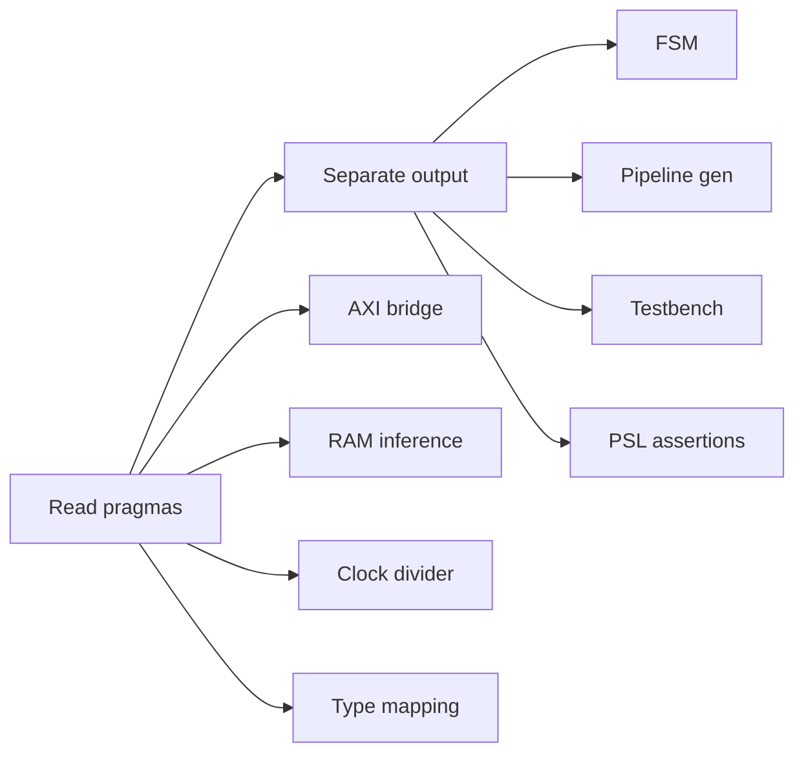

# Brief Compiler — VHDL Backend Completion Plan

**Date:** 2026-05-25
**Status:** Proposed
**Est. total:** ~930 lines added to `src/backend/vhdl.rs`

---

## Goal

Bring the VHDL backend (`src/backend/vhdl.rs`, currently 223 lines) to feature parity with the Verilog backend (`src/backend/verilog.rs`, 1805 lines). The VHDL backend already has full CLI dispatch through `main.rs` (`run_vhdl` → `run_vhdl_compile` → `run_vhdl`), loads HW config (`.dbv`/`.dbvs`/`.toml`), and runs hardware validation. The `#pragma` infrastructure is fully built (lexer, parser, AST). The gap is in the `VhdlGenerator` itself — it doesn't consume pragmas or generate the advanced constructs the Verilog backend does.

---

## Background

What already exists and works:

- **Lexer** (`lexer.rs:272`): `#pragma` and `#!pragma` tokens
- **Parser** (`parser.rs:2075`): parses `#pragma.c key(value)`, `#pragma bind(...)`, `#pragma key(value)`  
- **AST** (`ast.rs:659`): `Attribute { target: Option<String>, key: String, value: Option<String> }` on `StateDecl` and `Transaction`
- **Hardware** (`hardware/mod.rs:18`): `memory_pragmas` and `logic_pragmas` HashMaps
- **CLI dispatch** (`main.rs:1414-1429`): `brief vhdl <file> --hw <board.dbv>`
- **`run_vhdl`** (`main.rs:1959-2118`): full pipeline: parse → resolve → desugar → typecheck → HW validate → generate

---

## Steps

### Step 1: Read pragmas in VHDL backend

Add a helper that reads `attrs` from `StateDecl` and `Transaction` nodes, filtering by target:

```rust
fn get_pragma(&self, attrs: &[Attribute], key: &str) -> Option<&str> {
    attrs.iter()
        .find(|a| a.key == key && (a.target.is_none() || a.target.as_deref() == Some("vhdl")))
        .and_then(|a| a.value.as_deref())
}
```

Wire this into the `generate()` method loop over `program.items`.

### Step 2: Separate-component output

Change `generate()` to return `Vec<(String, String)>` — `(filename, source)` pairs:

- `top.vhd` — entity + structural architecture, instantiates components
- `axi_lite_slave.vhd` — AXI4-Lite slave (if interface = "axi4-lite" in HW config)
- `ram_<name>.vhd` — RAM inference per `bank` declaration
- `fsm.vhd` — state machine from `node` transactions
- `stage_<name>.vhd` — pipeline stage per `stage` declaration
- `txn_<name>.vhd` — synchronous process per reactive transaction
- `clk_div.vhd` — clock divider from `TargetConfig.clock_hz`
- `<entity>_pkg.vhd` — package with types, constants, component declarations

Top-level architecture instantiates all components with `port map`.

### Step 3: AXI4-Lite slave bridge

Generate a separate `axi_lite_slave.vhd` component with:

- Entity ports: `aclk`, `aresetn`, `s_axi_*` (AW, W, B, AR, R channels)
- State machine: IDLE → WRITE_ADDR → WRITE_DATA → WRITE_RESP → (back) vs READ_ADDR → READ_DATA → (back)
- Address decoder from `@ 0xADDRESS` annotations on state variables
- Read multiplexer from address
- Write logic to addressed registers

Reads `#pragma axi_address 0x...` or uses the existing `StateDecl.address` field.

### Step 4: RAM inference (BRAM/URAM)

For each `bank` declaration with `#pragma ram_style block` or `#pragma ram_style ultraram`:

- Generate `ram_<name>.vhd` with inferred BRAM/URAM
- Use VHDL-2008 `attribute ram_style : string;` for explicit style
- Dual `process (clk)` — one for write (sync), one for read (async or sync)
- Port width and depth from `bank` size and element type

### Step 5: Clock divider

Generate `clk_div.vhd` from `TargetConfig.clock_hz`:

- Entity: `clk_in`, `rst_in`, `clk_out`, `rst_out`
- Counter-based division from board clock to desired frequency
- Synchronised reset output

### Step 6: Full type mapping

Complete the `brief_type_to_vhdl()` method to handle all `Type` variants:

| Type | VHDL |
|------|------|
| `Bool` | `std_logic` |
| `UInt` | `std_logic_vector(N-1 downto 0)` |
| `Int` | `signed(N-1 downto 0)` |
| `Float` | `real` (simulation) or `std_logic_vector(63 downto 0)` (synthesis) |
| `String` | `string` |
| `Vector(inner, [dims])` | `array(0 to N-1) of <inner>` |
| `Tuple([types])` | `record` type |
| `Union([types])` | `record` with tag + max-size variant |
| `Option(inner)` | `record` with `valid: std_logic` + `value: <inner>` |
| `HashMap(K,V)` | BRAM-backed (dual-port) |
| `Constrained(base, [min, max])` | `subtype` |

### Step 7: State machine (FSM) from reactive transactions

Generate `fsm.vhd` with:

- `type state_type is (IDLE, LISTENING, DECODING, DISPATCHING, ERROR);` — inferred from `sys_mode` values
- `signal current_state, next_state : state_type;`
- Clocked process: `if rst = '1' then ... elsif rising_edge(clk) then current_state <= next_state;`
- Combinatorial process: `case current_state is ... end case;`
- Each `node` becomes a transition guard and action

### Step 8: Pipeline stages with generate loops

For each `stage` declaration:

- Generate `stage_<name>.vhd` with `for ... generate` for parallel channels
- Width from the stage's data type
- Propagation delay from `within` clause (for simulation assertions)
- Pipeline valid/ready handshake

### Step 9: Testbench generation

Generate a separate testbench `.vhd` that:

- Instantiates the top entity
- Generates clock and reset
- Reads input stimulus (optional from BOM file)
- Asserts expected outputs from Brief contracts
- Writes VCD waveform output

### Step 10: PSL assertion generation

For each contract `[pre][post]` on a `node`:

```vhdl
-- psl default clock is rising_edge(clk);
-- psl assert always (pre -> next(post)) report "Contract: <txn_name>";
```

Embedded as VHDL comments with `-- psl` prefix so tools that support PSL (e.g. GHDL, OneSpin) can extract them.

---

## Dependency Order

Steps 1-6 can be done in sequence. Steps 7-10 depend on 1 being in place but can overlap with 2-6.


