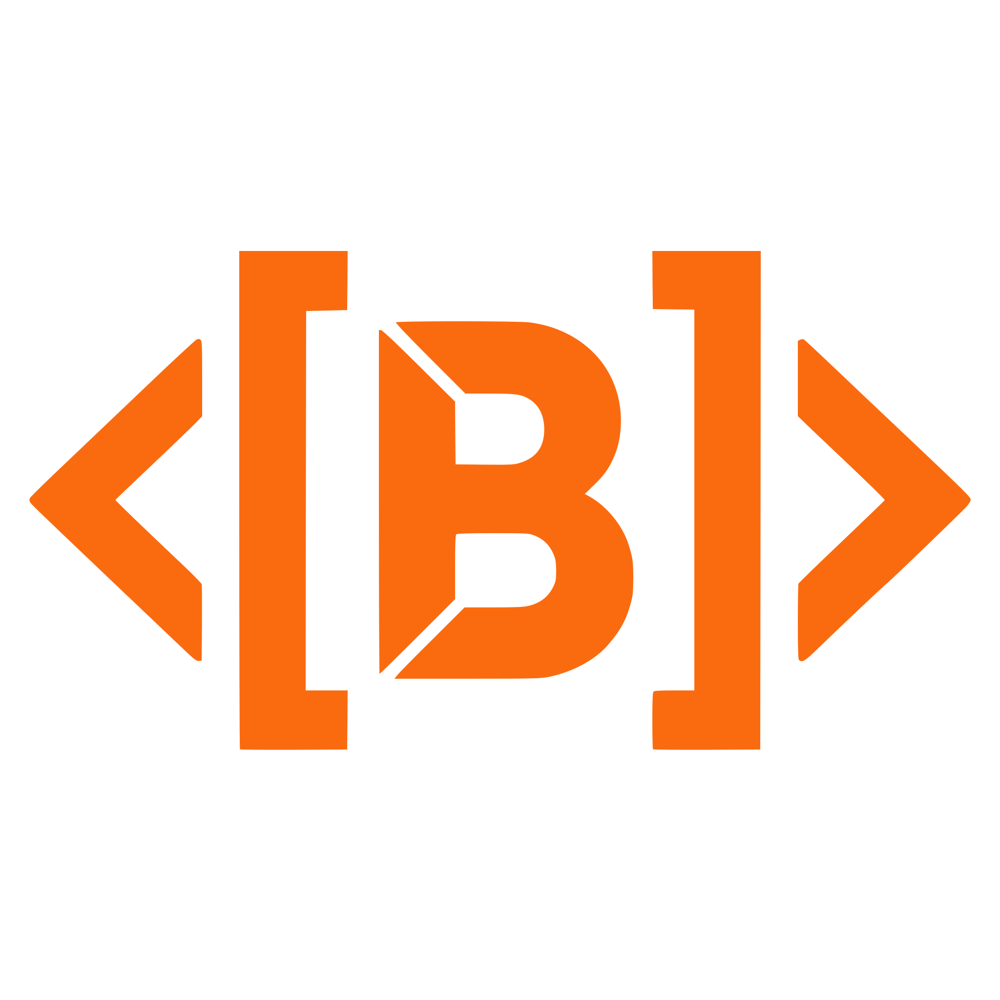

# Brief

 

## Brief Doesn't Break

Brief is a declarative language that tries to prove your code works before it runs.

Instead of commanding the computer through a sequence of steps like most imperative languages,
Brief asks: what should be true before this code runs, and what must be true after?
The compiler verifies that all logical paths actually lead to the conditions defined in the function's _contract_, a short declaration of what the function is expected to do under which conditions.

This catches bugs that many imperative languages let slip through:

- **Race conditions**: Through a Rust-inspired borrow checker, async transactions
  cannot run simultaneously if any writes to a variable the other might be reading.
- **Unintended side effects**: Every mutation is declared in a precondition/postcondition pair.
  Side effects outside declared boundaries are impossible.
- **Logic errors**: The proof engine traces every path through a transaction and
  verifies each reaches the intended postcondition.
- **Type errors**: Full type checking prevents mismatches before runtime.

If a bug still occurs, it's because the contract didn't fully express the intent.
But that makes the bug easy to find, as the contract shows exactly where expectation
and code diverged.

## Quick Start (5 minutes)

### 1. Install Brief

**Linux / macOS:**
```bash
# Clone this repository
git clone https://github.com/anomalyco/brief-compiler.git
cd brief-compiler

# Run the installer
chmod +x scripts/brief-install
./scripts/brief-install
```

**Windows:**
```powershell
# Clone this repository (or download ZIP)
git clone https://github.com/anomalyco/brief-compiler.git
cd brief-compiler

# Run the installer
.\scripts\brief-install.bat
```

The installer will copy the compiler to your user bin directory:
- Linux/macOS: `~/.local/bin/brief`
- Windows: `%LOCALAPPDATA%\brief\brief.exe`

Add to your PATH if needed:
```bash
# Linux/macOS
export PATH="$HOME/.local/bin:$PATH"

# Windows: Add %LOCALAPPDATA%\brief to your PATH via System Properties
```

### 2. Create a Project

```bash
brief init my-app
cd my-app
```

This creates two files:
- `main.bv` - Pure Brief (specification only)
- `main.rbv` - Rendered Brief (with web UI)

Feel free to delete whichever one you don't need.

### 3. Run Your App

```bash
brief run
```

Opens http://localhost:8080 in your browser with your app running.

## Why Declarative?

Declarative logic is inspired by several domains:

- **Prolog** and other pure logic languages showed that logical inference can replace explicit control flow
- **Dialog & Inform** (both interactive fiction languages) demonstrated how declarative
  state machines can elegantly express complex behavior
- **Rust** influenced how Brief handles state and correctness through strict
  boundaries and smart design principles baked into the language itself
- **React** inspired Rendered Brief's component model
- **SQL transactions** inspired Brief's transaction syntax and atomicity semantics

The insight: if you declare what must be true before and after a code block
(known more formally as a Hoare triple), the compiler can verify the transition is valid. This turns
assertions from optional boilerplate into mandatory first-class citizens.

## How the Reactor Works

Brief runs on a reactor loop that continuously checks if transactions are ready to fire:

1. All transactions declare preconditions (what must be true to run)
2. When a variable changes, the reactor re-evaluates affected transactions
3. Any _reactive_ transaction with a satisfied precondition fires automatically
4. Each firing updates state, potentially triggering more transactions
5. When nothing can fire, the reactor reaches equilibrium and waits

This replaces manual polling and event dispatchers with logical evaluation.
Instead of: _"check this condition, then fire this handler, then check that condition..."_
Brief says: _"When A is true, do B. When B is true, do C."_ The reactor and logical sequence figure out the rest.

## Example: A Complete Lifecycle

```brief
let counter: Int = 0;
let ready: Bool = false;

// Passive transaction (must be explicitly called)
txn initialize [~/ready] {
  &ready = true;
  term;
};

// Reactive transaction (fires automatically when precondition met)
rct txn increment [ready && counter < 5][counter > @counter] {
  &counter = counter + 1;
  term;
};

// Another reactive that depends on the first
rct txn notify_complete [ready && counter == 5][true] {
  log("Count complete!");
  term;
};
```

Walkthrough:
- `initialize` must be explicitly called, as it does not have the `rct` keyword. Its contract `[~/ready]` is synctactic sugar for `[~ready][ready]`, which means
  _"precondition: ready is false, postcondition: ready is true"_
- Once `initialize` fires, `ready` is mutated to become true inside the transaction
- Since `ready` is out of scope for initialise, it claims exclusive write access using the `&` symbol
- `term;` checks whether the postcondition is fulfilled, and exits the transaction if it does. If it does not, it keeps looping the transaction until it does, unless no path to the postcondition will be possible, which would have been caught at compile time. Here, we just need a single iteration to set `ready` to true 
- This, in turn, satisfies `increment`'s precondition: `ready && counter < 5`
- When `increment` fires, `counter` increases by 1. Its postcondition `[counter > @counter]`
  verifies the compiler that counter actually increased (@ refers to the value at transaction start)
- After 5 increments, `counter == 5`, satisfying `notify_complete`'s precondition
- The reactor handles the cascade automatically

Each transaction's postcondition is a guarantee the compiler verifies.
If any path through the transaction could violate it, compilation fails.

## Example of Caught Error: Broken Reactive Cascade

The real power comes when the compiler detects conflicts between reactive transactions:

```brief
let counter: Int = 0;
let ready: Bool = false;

rct txn initialize [~ready][ready] {
  &ready = true;
  term;
};

rct txn increment [ready && counter < 5][counter > @counter] {
  &counter = counter + 1;
  term;
};

// This transaction depends on counter reaching 5
rct txn notify_complete [counter == 5][true] {
  log("Done!");
  term;
};

// This is where we get offending code:
rct txn bad_reset [counter > 0][counter == 0] {
  &counter = 0;
  term;
};
```

The problem: `bad_reset` fires whenever `counter > 0`, immediately resetting it to 0.
This violates the logical chain needed to reach `counter == 5`, making `notify_complete` unreachable.

The compiler catches this and reports:

```
P001: ownership conflict in reactive cascade

transactions 'increment' and 'bad_reset' have conflicting reactive paths.
The postcondition of 'increment' ([counter > @counter]) would be immediately 
violated by 'bad_reset' ([counter == 0]), making 'notify_complete' unreachable.

Proof chain:
1. 'increment' fires when ready && counter < 5
2. 'increment' increments counter, satisfying postcondition counter > @counter
3. But 'bad_reset' fires when counter > 0, resetting counter to 0
4. This violates the logical chain needed to reach counter == 5
5. Therefore 'notify_complete' cannot fire: unreachable postcondition

Hint: resolve the conflict by either:
- Adding a guard to prevent 'bad_reset' from interfering with 'increment'
- Removing the conflicting transaction
- Reordering the reactive chain to be logically consistent
```

The compiler forces you to think about the entire reactive system as a coherent whole,
not just individual transactions. Every transaction's postcondition must flow logically 
into the next, or compilation fails.

## Implementation Status

Core features (working):
- Transactions with pre/post conditions (required on all)
- Reactive transactions (`rct txn`) auto-firing based on contracts
- Proof engine: termination and postcondition verification
- Type checking and inference
- FFI bindings to Rust and an open FFI system for other languages (with contract boundary enforcement)
- 59+ standard library functions
- Pattern matching and unification
- Imports and modular code organization
- Borrow-checker-inspired race condition prevention
- Rendered Brief (web UI framework)

Edge cases and limitations:
- Some complex termination proofs remain unresolved
- Complex generic type inference has gaps
- WASM compilation is functional but not optimized

Note on AI Integration:
If using an LLM to write Brief code, the language is designed with that in mind.
Contracts make intent explicit, helping LLMs generate more correct code.
A system prompt for Brief can be provided to guide model behavior.

## Usage

```bash
brief check program.bv          # Type check and verify
brief build program.bv          # Run
brief init my-project           # Create project
brief lsp                       # Start language server
```

## Full Language

- **Transactions**: `txn` and `rct txn` blocks with contracts
- **State**: Global variables (`let`, `const`)
- **Types**: String, Int, Float, Bool, Void, custom structs
- **Contracts**: Preconditions `[pre]` and postconditions `[post]`
- **Prior state**: `@variable` references the value at transaction start
- **Pattern matching**: Unification for handling multiple outcomes
- **Imports**: Modular code
- **Definitions**: Named functions with contracts (`defn`)
- **FFI**: Call other languages from Brief

## Documentation

- [SPEC-v6.2.md](spec/SPEC-v6.2.md) - Full language spec
- [FFI-USER-GUIDE.md](spec/FFI-USER-GUIDE.md) - Writing FFI interfaces
- [FFI-STDLIB-REFERENCE.md](spec/FFI-STDLIB-REFERENCE.md) - Available functions
- [examples/](examples/) - Example programs

## Building and Testing

```bash
cargo build --release
cargo test --lib          # Unit tests
cargo test                # All tests
```

## How It's Built

```
Lexer → Parser → Type Checker → Proof Engine → Interpreter
```

- **Lexer**: Tokenizes input
- **Parser**: Builds AST
- **Type Checker**: Verifies type correctness
- **Proof Engine**: Verifies each transaction reaches its postcondition
- **Interpreter**: Runs the reactive loop

## License

Apache 2.0
