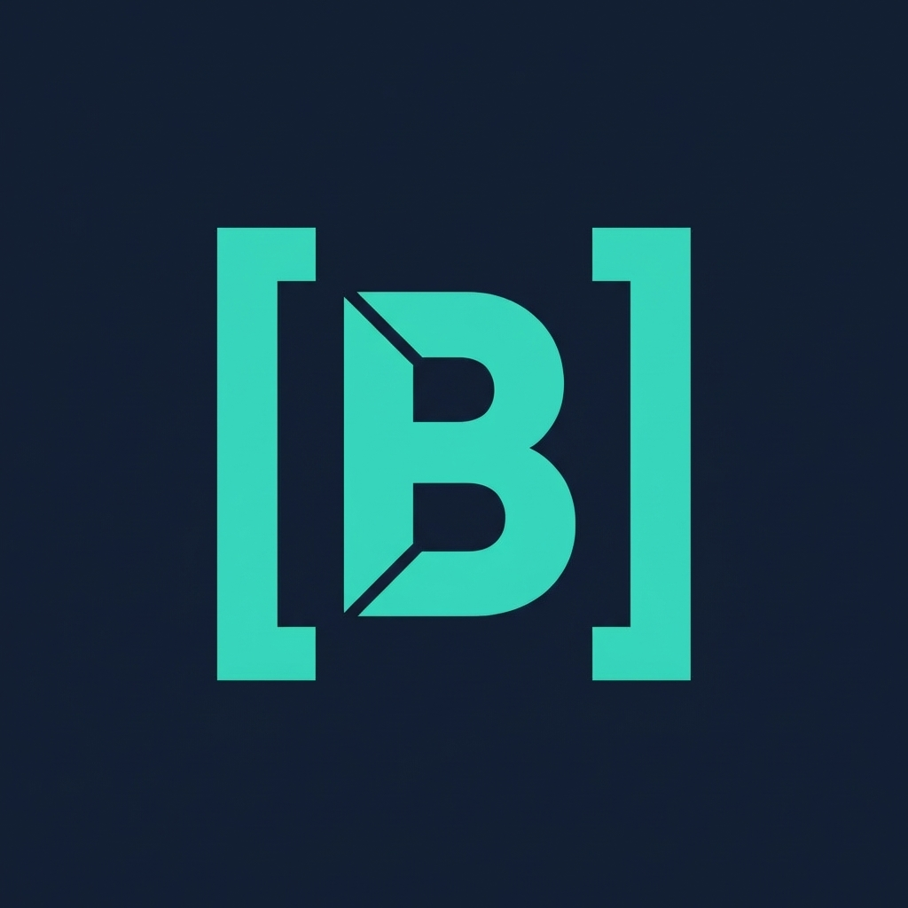

# Brief



**Brief doesn't break.**

A language for building state machines that are guaranteed to work correctly. The compiler verifies all state transitions before your code runs.

## What This Is

Brief is an early-stage language. It works, but it's not finished. We're building something ambitious: a practical way to write systems where you can prove the state machine is correct.

The idea is simple: state management bugs are the source of most application failures. We want to catch those bugs at compile time instead of in production.

## Why

Most production bugs are state-related:
- A state transition happened that shouldn't have
- Race conditions corrupted state
- Edge cases weren't handled
- Nobody could guarantee the system was correct

Brief's answer: declare what should be true before and after each state change, and let the compiler verify it's actually true.

## Example

```brief
let balance: Int = 100;

txn withdraw(amount: Int) 
  [amount > 0 && amount <= balance]      # Pre-condition: can only withdraw valid amounts
  [balance == @balance - amount]         # Post-condition: balance decreases by that amount
{
  &balance = balance - amount;
  term;
};
```

The compiler proves: if the precondition holds, this code executes and satisfies the postcondition. No test needed - it's mathematically verified.

## Current Capabilities

- **Transactions**: State changes with proven pre/post conditions
- **Signals**: Reactive state variables
- **Type system**: String, Int, Float, Bool, Void, custom structs
- **Pattern matching**: Safe data destructuring
- **Imports**: Modular code
- **FFI**: Call Rust functions (59 stdlib functions included)
- **Proof engine**: Verifies transaction contracts
- **Incremental compilation**: Fast development feedback
- **LSP support**: Editor integration

## Current Limitations

- Early stage. Syntax and features may change.
- Rendered Brief (web UI) is incomplete
- Complex generics not yet supported
- Some edge cases in proof verification still being worked out

## Install

```bash
cargo install --path .
```

## Usage

```bash
brief check program.bv          # Type check and verify
brief build program.bv          # Run program
brief init my-project           # Create project
brief import lib --path ./lib   # Add dependency
brief lsp                       # Start language server
```

## Documentation

- [brief-lang-spec.md](spec/brief-lang-spec.md) - Language specification
- [FFI-USER-GUIDE.md](spec/FFI-USER-GUIDE.md) - Using FFI to call Rust
- [FFI-STDLIB-REFERENCE.md](spec/FFI-STDLIB-REFERENCE.md) - Available stdlib functions
- [ARCHITECTURE.md](spec/ARCHITECTURE.md) - How the compiler works
- [examples/](examples/) - Example programs

## Project Structure

```
src/
├── lexer.rs       Tokenization
├── parser.rs      Parsing
├── ast.rs         AST definitions
├── typechecker.rs Type checking and inference
├── proof_engine.rs Contract verification and reachability
├── interpreter.rs Execution engine
├── reactor.rs     Event loop for reactive updates
├── ffi/           Foreign function interface (Rust integration)
└── main.rs        CLI

std/bindings/      Standard library FFI bindings
├── io.toml        File I/O functions
├── math.toml      Math functions
├── string.toml    String manipulation
└── time.toml      Timing functions

spec/              Language and design documentation
tests/             Integration and unit tests
examples/          Example Brief programs
```

## How It Works

1. **Lexer** tokenizes input
2. **Parser** builds syntax tree
3. **Type checker** verifies type correctness
4. **Proof engine** verifies each transaction's pre/post conditions are actually satisfied
5. **Interpreter** executes the verified code

If the code compiles successfully, the proof engine has verified your state machine is correct.

## Building

```bash
cargo build --release
```

## Testing

```bash
cargo test --lib          # Unit tests
cargo test                # All tests (including integration)
```

## Rendered Brief (Web UI)

Brief can compile to WebAssembly for reactive web components. This is still being developed.

```brief
<script type="brief">
  let count: Int = 0;
  txn increment [true][count == @count + 1] {
    &count = count + 1;
    term;
  };
</script>

<view>
  <p b-text="count">0</p>
  <button b-trigger="increment">+</button>
</view>
```

## Status

| Component | Status |
|-----------|--------|
| Core Language | Working |
| Type System | Working |
| Proof Engine | Working |
| FFI System | Working |
| Standard Library | 59 functions available |
| Rendered Brief (UI) | In progress |

## What We're Trying to Do

Make it practical to write systems where you can actually prove the state machine is correct. Not academic research, but real tools for real systems.

The longer-term goal is to extend this to distributed systems, async operations, and more complex verification. But for now, we're focusing on getting the foundations solid.

## Contributing

We're a small team. Most valuable contributions right now:

1. Bug reports and fixes
2. Documentation and examples
3. More FFI bindings for useful libraries
4. Performance improvements
5. Rendered Brief completion (web UI framework)

## License

MIT

---

**Getting started**: Try [examples/](examples/) or read [spec/brief-lang-spec.md](spec/brief-lang-spec.md).

**Questions or bugs?** Open an issue.
