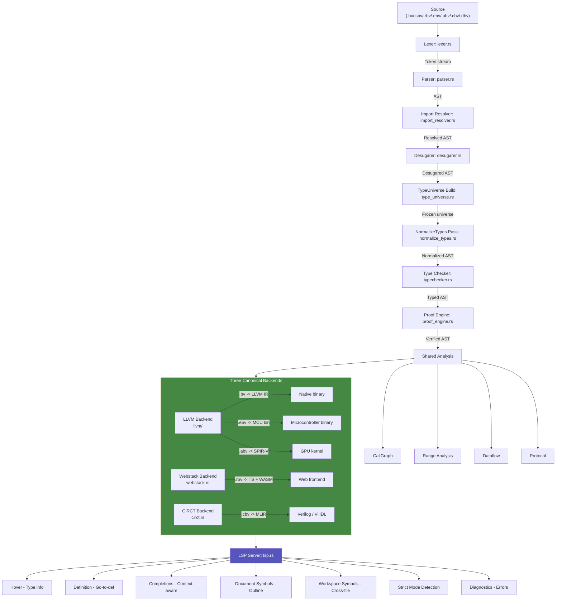

# Brief: A Programming Language

| <br/> <p align="center">*Breeve*, the Cybersphinx<p> <p align="center"><sup><sub>(For those people who like a mascot to come with their language)</sup></sub><p> | <br/><p align="center">**Brief**<p><br/><p align="center">**Embedded Brief**<p><br/><p align="center">**Accelerated Brief**<p> | <br/><p align="center">**Rendered Brief**<p><br/><p align="center">**Data Brief**<p><p align="center">**Circuit Brief**<p> |
|---|---|---|

## Brief Doesn't Break

**Status:** v0.18.0 — GLUE Bridge Protocol, TOML-Driven Export, Cross-Language FFI Pipeline

Brief is a declarative, contract-enforced logic language designed for building verifiable state machines. It treats program execution as a series of verified state transitions rather than sequential instructions. The file extension selects the compilation target. Each one optimizes the same contract-proven logic for a different material:

| Extension | Variant | Compiles to |
|-----------|---------|-------------|
| `.bv` | **Brief** | LLVM native binary (optional SPIR-V offload) |
| `.rbv` | **Rendered Brief** | TypeScript + frontend code + WASM sidecars |
| `.ebv` | **Embedded Brief** | LLVM microcontroller binary |
| `.abv` | **Accelerated Brief** | SPIR-V GPU kernel |
| `.cbv` | **Circuit Brief** | CIRCT hardware description (Verilog/VHDL) |
| `.dbv` / `.dbvs` / `.dbvl` | **Data Brief** | Configuration data parsed by Brief itself |

The main sources of inspiration are Rust (by Graydon Hoare and the Rust community) and Dialog (by Linus Åkesson). Specifically the fact that both have a very strict compiler, that catches bad code before it ever compiles, simply through smart conventions. Especially the declarative nature is inspired by Dialog, as a direct successor of Prolog, since Dialog showed that setting up a series of predicates could be sufficient to have a compiler figure out a complex runtime capable of simulating a world. And the reactor loop? That was inspired by, well... React. As such, everything in Brief is designed to, in some way, aid in predictable runtime cascades. You set up the first billiard ball, and based on the variables present describing the overall "state", the rest of the balls predictably scatter.

Note that much of this language design was inspired by designing a language that would be impossible for an LLM to get wrong. Therefore it feels important to me to disclaim a lot of AI has been used in building this compiler. The design is fully my own (Randy Smits-Schreuder Goedheijt), but much of the programming was handled by LLMs, and the verification by hand and a series of unit tests (which LLMs somehow manage to cut the corners of). As such, you will find comments, markdown files and many more typical signs of LLM usage in this repository. These all exist to help steer the LLM into *correctly* modifying and applying the design decisions I have made, as it would otherwise be prone to hallucinate a novel language like this. Ergo, you will find a veritable library of markdown files written by AI, just to make sure everything got documented as I went.

If you've gotten this far, I thank you for reading, and I hope you will have enjoyed your *Brief* time here so far.

Regards,

**Randy**

## The Thesis: Topology over Timing

Most programming languages are built around _operations in sequence_. Brief describes the _sequence of operations_ - the spatial connections between logical states.

*   **Logic as a Map:** Brief defines a world where roads exist all at once. The "sequence" is the _connection_, not the _timing_.
*   **Physical Isomorphism:** Because the logic defines a _shape_ rather than a _schedule_, it adapts to the physics of its material:
    *   **In Software:** The compiler hires a worker (the CPU) to walk these roads in order.
    *   **In Hardware:** The compiler builds the roads directly out of copper.
*   **Variable Logic:** The logic remains invariant while the material changes. A square is a square whether it's drawn in the sand or forged in steel.

**Deep Dive:** There are several .md documents scattered across the repo with random ideas on optimizing the language. Some are outdated, some aren't, but they should show the development of the Brief philosophy over time, and ways in which the topological approach has allowed backend optimization not otherwise available.

## The Philosophical Pillars

### All operations are expressed in transactions, and only transactions can call operations. They either complete fully, or not at all.

Transactions are inherently cyclical. If you properly define a postcondition a cyclically executed transaction will eventually reach, it automatically starts behaving like a loop, but one that can predictably halt. A transaction with `[pre][post]` converges when the precondition becomes false. This means the postcondition describes the terminal state, and the precondition is the loop condition. You do not write `while (counter < 100)`, instead the precondition `[counter < 100]` already says "keep running while this holds." You do not write `for (i = 0; i < N; i++)`, here too the postcondition `[i == @i + 1]` expresses the step and the invariant all at once. The compiler proves the postcondition is reachable and that the loop terminates. This gives the contract system a role beyond *merely* serving the proof engine.

### Brief doesn't need you to be correct, it just needs you to be right.

The contract logic often just requires you to declare either the precondition or postcondition, not both. Contracts are simultaneously specification AND optimization input. In most languages, types/specs are safety rails that constrain what you can do. In Brief, they're also what the optimizer feeds on. The more you declare, the more the compiler can prove, and the faster your program runs. The file extension system (.bv → warnings, .sbv → hard errors) embodies the idea that you opt into strictness as your understanding deepens. Partial contracts compile with warnings. Full contracts with strict mode compile with proofs. This is a choice that distinguishes Brief from total languages (Coq, Agda) where you must prove everything upfront, and from mainstream languages where you prove nothing.

### Execution is inferred, not prescribed.

Programs are declared through a combination of variables, definitions and transactions. The entire program runs on a non-polling reactor loop. It indexes which variable changes lead to which `node` preconditions to be fulfilled, and fires them automatically when it's their time to act. Because these paths are laid out predictably, the compiler has great leeway in folding these paths. If X through A, B and C will always lead to Y with side-effect Z, the compiler will simply draw a short route from X to YZ.

### No magic, but I had to compromise somewhere.

Every function and keyword in Brief must be traceable to a source following the same rules as every other definition. If it looks like `foo(x)`, it is user-defined. Period. The exception is `#`-suffixed intrinsics like `print_int#`, `sqrt#`, `put_char#`. These are baked into `Expr::IntrinsicCall` in the AST, but they are *explicitly* marked with the `#` at every call site. You can never mistake `sqrt` for `sqrt#`. The `#` is the compiler saying "I have a hand in this one." It is a compromise, but an honest one.

The "coding" system, where top-level `let` declarations and guarded blocks get implicitly wrapped into a reactive transaction, is the one invisible transformation the compiler does. But the transformation is predictable and the same for every program. It is the practical muscle behind "execution is inferred, not prescribed." The compiler tells you what it inferred. You can always look at the expanded form.

Anything interacting with an external language or interrupt source must be declared explicitly. Which FFI path that takes depends on your target:
- **LLVM target** (`.bv`, `.ebv`): `frgn from "c"` resolved via `brief_rt.c`.
- **Web target** (`.rbv`): `frgn from "javascript"` inlined into generated TypeScript.
- **Hardware target** (`.cbv`): no FFI allowed. If you need something external, it comes through an intrinsic. This is the strictest tier, because you are describing copper.
- **GPU target** (`.abv`): intrinsics only, same as hardware.

### Contracts are optimization fuel, not a correctness tax.

This is an odd one I discovered I could do while optimizing Brief. In most languages, a precondition, assertion or some other safety wrapper is you doing the compiler or even just the runtime a favor to prevent messy logic from crashing the program. In Brief, the contract *is* the optimization input. The more you declare, the more the compiler proves, and the faster your program runs. Safety enables speed.

A precondition like `[x < N]` does more than guard the transaction. The compiler uses this information to emit `!range` metadata on the field load, which lets LLVM eliminate bounds checks in the loop body. More contracts means more metadata, which means more guarantees about the code. The optimizer feeds on what the prover proves.

This is why strict variants (`.sbv`, `.cbv`) ban sugar syntax. If you are writing hardware or safety-critical code, you should not take shortcuts. The full `[pre][post]` contract is the compiler's primary optimization signal. When you omit one side, you are leaving performance on the table, but also opening yourself up to unpredictable and undefined behaviour. However, sometimes this asks too much of a programmer, which is why the file extension serves as the opt-in.

So, instead of thinking *"safety checks slow me down, I will add them later."*, think *"the compiler cannot optimize what it cannot prove."* Write the contract first. The performance follows.

### Friction is a signal...

There is no `if/else` in Brief. There are guarded blocks: `[condition] { body }`. This is not an omission. A guard forces you to ask "what must be true for this to execute?" rather than "which branch do I take?" If it feels harder than `if`, that is because you are specifying an invariant instead of a jump. The friction is the point. Operators that alter normal flow are marked with `!`: `term!` exits the program, `trg!` fires a hardware trigger, `sync!` forces a barrier, `$!` marks a high-power macro with access to `compile#`, `gensym#`, and `error#`. The `!` is the language saying "this is not a normal operation." If it feels heavy, good. It should. The strict variants (`.sbv`, `.cbv`) exist precisely to add friction. Sugar is banned, full contracts are required. You opt into strictness as your understanding deepens. The compiler does not let you take shortcuts when the material (hardware, safety) cannot afford them.

### ...but the compiler must help you through it.

Friction without explanation is frustration. Every denied sugar, every strict-mode requirement, every full-contract demand should tell you *why* and *what to do instead*. If the compiler says "no," it should say "here is the path I can accept." This is why the language design keeps error messages concrete. A warning like `sugar syntax [[post]] not allowed in .cbv files, write [pre][post] explicitly` is better than `invalid syntax`. The friction exists to make you think, not to waste your time. The compiler's job is to make sure you know the difference.

### Operator Taxonomy

Brief's operators are organized into three conceptual groups:

| Group | Operators | Purpose |
|-------|-----------|---------|
| **Lens Operators** | `<:` (Derivation), `:>` (Projection) | Type boundaries and semantic lenses — restricts what conforms to a type, or reveals meaning through a lens |
| **Partition Operators** | `[]`, `@/` | Segment layouts into addressable sub-ranges — constrains focus to a spatial slice |
| **Transfer Operator** | `<-` | Directional data movement across layout boundaries — push, pop, discard, transfer |

The **Anchor** (`@`) is the universal symbol for spatial and temporal location, used across all groups: prior state (`@balance`), bit positions (`@/0..3`), string literals (`@"..."`), and hardware links (`trg timer @ 1kHz`).

## Quick Start

### 1. Build the Compiler

```bash
# Build in debug mode
cargo build

# Build in release mode
cargo build --release

# Run tests
cargo test --lib
```

### 2. Create Your First Program

Create `counter.bv`:

```brief
let counter: Int = 0;

txn increment() [counter < 100][counter == @counter + 1] {
    &counter = counter + 1;
    term;
};

txn main() [true][true] {
    increment();
    increment();
    increment();
    term;
};
```

### 3. Compile and Run

```bash
# Type-check only (fast)
./target/debug/brief-compiler check counter.bv

# Compile to a native binary (LLVM → machine code)
./target/debug/brief-compiler build counter.bv

# Web frontend (TypeScript + view bindings)
./target/debug/brief-compiler build counter.rbv

# Embedded/microcontroller binary
./target/debug/brief-compiler build counter.ebv

# SPIR-V GPU kernel
./target/debug/brief-compiler build counter.abv

# CIRCT hardware description
./target/debug/brief-compiler build counter.cbv

# Validate Data Brief configuration
./target/debug/brief-compiler build counter.dbv

# Emit LLVM IR instead of a binary
./target/debug/brief-compiler build --llvm counter.bv

# Check + Build (typecheck without execution, then compile)
./target/debug/brief-compiler check counter.bv
./target/debug/brief-compiler build counter.bv
```

## Language Variants

The file extension selects which backend compiles your program, and what syntax rules apply. Each variant is a different *view* of the same contract-proven core — the same reactive transaction model, the same `[pre][post]` contracts — but adapted for a different material or strictness tier:

| Type | File Ext | Description | Compilation Target |
|------|----------|-------------|-------------------|
|  **Brief** | `.bv` | Pure declarative logic | LLVM → native binary, optional SPIR-V offload |
|  **Accelerated Brief** | `.abv` | GPU compute kernel | SPIR-V (GPU intrinsics, no FFI, restricted types) |
|  **Rendered Brief** | `.rbv` | Reactive web UI | TypeScript + WASM sidecars + view bindings |
|  **Embedded Brief** | `.ebv` | Microcontroller bare-metal | LLVM → microcontroller binary (no OS, no GC) |
|  **Circuit Brief** | `.cbv` | Pure hardware logic graph | CIRCT → Verilog/VHDL (no FFI, no external deps) |
|  **Data Brief** | `.dbv` / `.dbvs` / `.dbvl` | Configuration data, schemas, line-based databases | Parsed and validated by Brief itself, consumed by all targets |

### Why Variants Exist

Each variant has a different *contract baseline* and *feature set* appropriate to its target. The `s` prefix (Strict Brief — `.sbv`, `.srbv`, `.sebv`) uses the **same backend** as its base variant but enforces stricter syntax rules:

| Variant | Contract Sugar | Intrinsics | `frgn` | Typical Use |
|---------|---------------|------------|--------|-------------|
| `.bv` (Brief) | `[[post]`, `[pre]]` | All available | C, Rust, Python, Java, JavaScript | General-purpose |
| `.rbv` (Render) | sugar allowed | All available | JavaScript (inlined); C/Rust via WASM | Web frontends |
| `.ebv` (Embed) | sugar allowed | All available | C, Rust (Python/Java warned) | Bare-metal MCU |
| `.cbv` (Circuit) | sugar banned | Hardware subset only | Banned | Hardware synthesis |
| `.dbv` (Data) | No contracts | None | None | Configuration |


The rationale: **contracts are optimization information**. The more complete your contracts, the more the compiler can prove, and the faster your program runs. Sugar syntax (`[[post]`, `[pre]]`) is a convenience for prototyping, but strict variants force you to commit to full specifications. This is what makes Brief different from total languages (Coq, Agda — must prove everything upfront) and mainstream languages (C, Rust — prove nothing by default).

**Planned:** COBOL backend (future target for enterprise integration).

## Key Features

### 1. Contracts First

Every transaction declares what must be true **before** and **after**:

```brief
txn withdraw(amount: Int) 
    [amount > 0 && balance >= amount]  // Precondition
    [balance == @balance - amount]      // Postcondition
{
    &balance = balance - amount;
    term;
};
```

The compiler **verifies** that your code satisfies these contracts.

### 2. Reactive by Default

Transactions fire automatically when preconditions are met:

```brief
node auto_save() [dirty && !saving][!dirty] {
    save_to_disk();
    &dirty = false;
    term;
};
```

No event handlers. No polling. Just logic.

### 3. Zero-Nesting Logic

No `if/else` chains. Use guards:

```brief
[x > 0] {
    &result = x * 2;
};
[x < 0] {
    &result = x * -1;
};
[x == 0] {
    escape;  // Rollback
};
```

### 4. GLUE Protocol Bridge — Cross-Language FFI

Brief can export functions to any language via the GLUE (Generated Language Universal Exchange) bridge system:

```brief
// Export a function for Rust/Python/Node
export defn brief_pp_type(n: String) -> String {
    term pp_type(n);
};
```

```bash
# Generate native wrappers for any language (TOML-driven, no hardcoded generators)
brief export bridge.bv rust --out ./rust-crate   # Compilable Rust crate with safe wrappers
brief export bridge.bv python --out ./py-module  # ctypes Python module
brief export bridge.bv node --out ./node-module  # ffi-napi Node.js module
```

**How it works — Protocol-Driven, Not Type-Driven:**
- The TOML config maps protocol categories (`#String`, `#Int`, `#Float`) to language-native types — not Brief internal types
- The BFS protocol path optimizer finds the cheapest transform between Brief's representation and the target language's representation
- Identity paths (same protocol with compatible layout) compile to **zero instructions** at LTO time
- Redundant CastTo/CastFrom chains cancel out — ASCIIString → `#String` → Rust `&str` produces zero work
- Adding a new language = adding a `[lang]` section to `lib/glue.toml` — zero Rust changes

**The GLUE pipeline:**
```
.bv → brief build --llvm → .ll (real function bodies, no stubs)
    → llc → .o → cc → .so → loaded via libloading/ctypes/ffi-napi
    → 7μs per call (C FFI), 6.5μs per call (Brief GLUE) — 3.5% slower, both correct
```

**GLUE is an ABI generator, not an FFI.** It computes, emits, and optimizes away the interface between languages. See `docs/architecture/glue-as-abi-generator.md`.

### 5. Metropolitan FFI — Shared Memory IPC

The Metropolitan system enables zero-copy communication between Brief processes and foreign programs via shared memory:

```brief
// Create a Metropolitan channel 
let channel = MetroChannel::new(1024);
channel.write(&my_data);
```

- **Shared memory segments** with atomic read/write semantics
- **Auto-notification** via signal triggers when new data arrives
- **Consensus protocol** for multi-process coordination
- **60+ built-in mapper functions** for byte serialization
- **876 lines** of production code in `src/ffi/metropolitan.rs`

### 6. Compile-Time Verification

The compiler proves:
- No race conditions
- No unintended side effects  
- All contracts are satisfied
- No deadlocks in async code

## Compiler Architecture


```mermaid
graph TD
    S["Source<br>(.bv/.sbv/.rbv/.ebv/.abv/.cbv/.dbv)"] --> Lex[Lexer: lexer.rs]
    Lex -->|Token stream| Par[Parser: parser.rs]
    Par -->|AST| Imp[Import Resolver: import_resolver.rs]
    Imp -->|Resolved AST| Des[Desugarer: desugarer.rs]
    Des -->|Desugared AST| UB[TypeUniverse Build: type_universe.rs]
    UB -->|Frozen universe| NT[NormalizeTypes Pass: normalize_types.rs]
    NT -->|Normalized AST| TC[Type Checker: typechecker.rs]
    TC -->|Typed AST| PE[Proof Engine: proof_engine.rs]
    PE -->|Verified AST| SA[Shared Analysis]

    SA --> CA[CallGraph]
    SA --> RA[Range Analysis]
    SA --> DA[Dataflow]
    SA --> PR[Protocol]

    SA --> Backends[Three Canonical Backends]

    subgraph Backends[Three Canonical Backends]
        LLVM[LLVM Backend<br>llvm/]
        Web[Webstack Backend<br>webstack.rs]
        CIRCT[CIRCT Backend<br>circt.rs]

        LLVM -->|.bv -> LLVM IR| Native[Native binary]
        LLVM -->|.ebv -> MCU bin| MCU[Microcontroller binary]
        LLVM -->|.abv -> SPIR-V| GPU[GPU kernel]

        Web -->|.rbv -> TS + WASM| WebApp[Web frontend]
        CIRCT -->|.cbv -> MLIR| HDL["Verilog / VHDL"]
    end

    Backends --> LSP[LSP Server: lsp.rs]

    LSP --> Hover[Hover - Type info]
    LSP --> Def[Definition - Go-to-def]
    LSP --> Comp[Completions - Context-aware]
    LSP --> Sym[Document Symbols - Outline]
    LSP --> WsSym[Workspace Symbols - Cross-file]
    LSP --> Strict[Strict Mode Detection]
    LSP --> Diag[Diagnostics - Errors]

    style LSP fill:#55b,color:#fff
    style Backends fill:#484,color:#fff
```

## Standard Library

### Core Types
- **Char** - Unicode codepoints
- **HashMap<K,V>** - O(1) lookup
- **HashSet<T>** - O(1) membership
- **StringBuilder** - O(n) string building
- **Stack<T>** - LIFO structure
- **Queue<T>** - FIFO structure
- **Result/Option** - Error handling with combinators

### String Processing
- Character classification (`is_whitespace`, `is_digit`, `is_alpha`)
- Case conversion (`to_upper`, `to_lower`, `capitalize`)
- String manipulation (`trim`, `reverse`, `split`, `join`)
- 95% native functions (no FFI)

### Collections
- `List<T>` - Dynamic arrays
- Vector operations
- Sorting, filtering, mapping

### IO & Process
- File I/O (`read_file`, `write_file`, `file_exists`)
- Path operations (`join_path`, `split_path`, `file_extension`)
- Process spawning (`spawn`, `spawn_with_output`)
- Environment access (`env_var`, `current_dir`)

### OS Prelude (auto-imported, 20 modules)
The `std/os/` modules replace 127 former compiler intrinsics:
- **fs.bv** — open, close, read, write, lseek, pread, pwrite, stat, ftruncate, fsync, dup, fcntl
- **net.bv** — socket, bind, listen, accept, connect, send, recv, setsockopt, getaddrinfo
- **dir.bv** — mkdir, rmdir, unlink, rename, symlink, readlink, getcwd, readdir, chmod, chown, access
- **thread.bv** — thread_create, thread_join, mutex_lock, mutex_unlock, condvar_wait, condvar_signal
- **atomic.bv** — atomic_load, atomic_store, atomic_cas, atomic_xchg, atomic_add, fence, futex
- **mem.bv** — mmap, munmap, mprotect, brk, mlock
- **process.bv** — spawn, getpid, getppid, exit, abort, sleep
- **signal.bv** — sigaction, sigprocmask, kill, signal_fd, timerfd_create
- **time.bv** — clock_gettime, nanosleep, time
- **ipc.bv** — pipe, shm_open, shm_unlink, sem_open, sem_wait, sem_post
- **io.bv** — print, println, readln, get_env, set_env
- **tty.bv** — tty_raw_mode, tty_size, tty_read_key, ioctl, isatty
- **user.bv** — getuid, geteuid, getgid, getegid
- **sched.bv** — sched_yield, getpriority, setpriority
- **resource.bv** — getrlimit, setrlimit
- **sysinfo.bv** — uname, hostname, realpath, pagesize, cpu_count
- **dynlib.bv** — dlopen, dlsym, dlclose
- **debug.bv** — backtrace, halt, abort
- **temp.bv** — mkstemp, mkdtemp
- **ring.bv** — ring_push, ring_pop
- **rand.bv** — getrandom, errno

### Iterators
- `map`, `filter`, `fold`
- `take`, `skip`, `zip`, `chain`
- `sum`, `product`, `min`, `max`
- `find`, `any`, `all`

**Total:** 300+ native functions across 15+ modules + 20 auto-imported OS modules

## Learning Brief

Start with our comprehensive tutorial:

```bash
cd learn-brief
```

1. **[00-welcome.md](learn-brief/00-welcome.md)** - What is Brief?
2. **[01-basics.md](learn-brief/01-basics.md)** - Variables, types, transactions
3. **[02-contracts.md](learn-brief/02-contracts.md)** - Preconditions & postconditions
4. **[03-reactive.md](learn-brief/03-reactive.md)** - Reactive transactions
5. **[11-triggers.md](learn-brief/11-triggers.md)** - Triggers and reactive I/O (`trg`, `trg!`)
6. **[13-projections.md](learn-brief/13-projections.md)** - `:>` metadata projections (Width, Endian, Codec, Ops)
7. **[15-custom-types.md](learn-brief/15-custom-types.md)** - Custom type definitions with operator declarations

**Full documentation:**
- [spec/SPEC.md](spec/SPEC.md) - Complete language specification
- [spec/LANGUAGE-TUTORIAL.md](spec/LANGUAGE-TUTORIAL.md) - Detailed tutorial
- [spec/QUICK-REFERENCE.md](spec/QUICK-REFERENCE.md) - Syntax cheat sheet
- [lib/std/README.md](lib/std/README.md) - Standard library guide
- [lib/compiler/README.md](lib/compiler/README.md) - Compiler architecture
- [docs/architecture/bits-thesis.md](docs/architecture/bits-thesis.md) - Strong Bits thesis design
- [learn-brief/15-custom-types.md](learn-brief/15-custom-types.md) - Custom type definitions guide

---

## Examples

### Counter (Basic)
```brief
let counter: Int = 0;

txn increment() [counter < 100][counter == @counter + 1] {
    &counter = counter + 1;
    term;
};
```

### Bank Account (Contracts)
```brief
let balance: Int = 1000;

txn deposit(amount: Int) 
    [amount > 0]
    [balance == @balance + amount]
{
    &balance = balance + amount;
    term;
};

txn withdraw(amount: Int) 
    [amount > 0 && balance >= amount]
    [balance == @balance - amount]
{
    &balance = balance - amount;
    term;
};
```

### Shopping Cart (Reactive)
```brief
let items: Int = 0;
let total: Float = 0.0;
let discount_applied: Bool = false;

node add_item(price: Float) [true][items == @items + 1] {
    &items = items + 1;
    &total = total + price;
    term;
};

node apply_discount() 
    [items > 10 && total > 100.0 && !discount_applied]
    [total < @total && discount_applied == true]
{
    let discount = total * 0.1;
    &total = total - discount;
    &discount_applied = true;
    term;
};
```

See [examples/](examples/) for more.

## Performance

| Component | Complexity | Optimization |
|-----------|------------|--------------|
| **HashMap** | O(1) | Hash lookup |
| **StringBuilder** | O(n) | Amortized append |
| **Lexer** | O(n) | Single pass |
| **Parser** | O(n) | Recursive descent |
| **Type Checker** | O(n·α(n)) | Union-Find |
| **Proof Engine** | O(2^b) pruned | BFS with pruning |
| **Code Generation** | O(n) | Single pass |

**See:** [OPTIMIZATIONS.md](OPTIMIZATIONS.md) for complete analysis.

## Testing

```bash
# Run all library tests
cargo test --lib

# Run specific test module
cargo test --lib lexer::tests
cargo test --lib analysis::call_graph::tests
cargo test --lib backend::llvm::tests

# Check a Brief file
./target/debug/brief-compiler check examples/counter.rbv

# Check in strict mode
./target/debug/brief-compiler check --strict counter.sbv
```

**Test Suite (1,403 tests):**
- `tests/tier1/` - Core data type tests
- `tests/tier2/` - String processing tests
- `tests/backends/` - Backend generation tests
- `tests/ffi_*.rs` - FFI parser, typechecker, stdlib, proof engine tests
- `tests/fuzz_frontend.rs` - AST roundtrip fuzzing
- `tests/fuzz_backend.rs` - Backend codegen fuzzing
- `tests/fuzz_fault_injection.rs` - Error recovery fuzzing
- `src/analysis/*/tests/` - CallGraph, Range analysis, etc.
- `src/ffi/metropolitan.rs/tests` - Shared memory IPC tests

**See:** [docs/reports/TESTING_SUMMARY.md](docs/reports/TESTING_SUMMARY.md) for complete results.

---

## Self-Hosting Status

The Brief compiler can now:
- Parse itself
- Type-check itself
- Verify its own contracts
- Generate code for itself (3 canonical backends)
- Run shared analysis (CallGraph, range inference) in both Rust and Brief

**Implementation:**
- 3 canonical backends (LLVM, CIRCT, Webstack)
- 300+ standard library functions
- ~141,000 lines of Rust bootstrap compiler
- ~11,300 lines of Brief self-hosted compiler
- ~75,000 lines of documentation
- 1,403 passing tests

**Key v0.18.0 additions:**
- **GLUE Protocol Bridge**: TOML-driven cross-language FFI, protocol-path BFS optimization, `brief export` subcommand
- **Protocol-driven type mapping**: `type_map`/`c_type_map`/`conversions` replaced by `protocols` mapping protocol categories to language types
- **Full backend export**: `brief export` uses `LlvmBackend::generate()` (no `ret i64 0` stubs)
- **Round-trip FFI tests**: 8 integration tests verifying full pipeline from `.bv` to FFI call
- **Bridge benchmark**: Python ↔ C vs Brief via ctypes (C 5988ns, Brief 6203ns, ✅ all match)
- **Dynamic GLUE config**: `#[serde(flatten)]` language discovery — zero hardcoded language names in Rust
- **C-compatible string format**: `[length][data]` format matching `brief_rt.c`
- **`emit_protocol_chain`**: Real LLVM IR emission for Bitcast, MeldShuffle, ProtocolTransform kinds
- **Arena allocator budget control**: `--optimize-budget 0` uses direct `malloc`
- **Configurable arena size**: `arena_initial_size` field replaces magic 65536 constant

**Performance improvements (v0.16 → v0.17):**
| Benchmark | v0.16 | v0.17 | Winner |
|-----------|-------|-------|--------|
| nbody_newton | 1.35x | **1.05x** | **~tie** |
| fannkuch_redux | 1.31x | **0.95x** | **Brief** |
| fasta | 1.23x | **1.10x** | ~tie |
| ring_buffer | 1.45x | **1.10x** | ~tie |
| float_math_nonzero | 2.21x | **0.94x** | **Brief** |

**See:** [docs/plans/2026-07-21-rct-txn-to-node-rename-and-benchmark-fixes.md](docs/plans/2026-07-21-rct-txn-to-node-rename-and-benchmark-fixes.md) for the comprehensive plan and current benchmark results.

## Project Structure

```
brief-compiler/
├── src/                          # Rust bootstrap compiler
│   ├── main.rs                   # CLI: check, build, compile, bind, metrod, lsp
│   ├── lib.rs                    # Crate root
│   ├── ast.rs                    # AST definitions
│   ├── parser.rs                 # Rust parser
│   ├── import_resolver.rs        # Module import resolution
│   ├── desugarer.rs              # AST desugaring
│   ├── typechecker.rs            # Type checker
│   ├── proof_engine.rs           # Proof engine + CallGraph integration
│   ├── lsp.rs                    # LSP server (hover, definition, completions, symbols)
│   ├── reactor.rs                # Reactive runtime
│   ├── signal_graph.rs           # Signal dependency tracking
│   │
│   ├── analysis/                 # Shared program analysis
│   │   ├── call_graph.rs         # Transaction call graph + cycle detection
│   │   ├── range.rs              # Parameter bounds inference
│   │   ├── dataflow.rs           # Read/write dependency analysis
│   │   ├── protocol.rs           # Control register prerequisites
│   │   ├── address_space.rs      # Memory address classification
│   │   ├── cross_reference.rs    # Address validation
│   │   ├── entry_point.rs        # Triggerable transaction discovery
│   │   └── struct_generator.rs   # State struct generation
│   │
│   ├── backend/                  # Three canonical code generation backends
│   │   ├── llvm/                 # LLVM IR — native, embedded, SPIR-V (active)
│   │   ├── webstack.rs           # TypeScript + WASM — web target (active)
│   │   ├── circt.rs              # CIRCT MLIR — hardware target (active)
│   │   └── mod.rs                # Backend registry + dispatch
│   │
│   └── archive/backend/          # Retired backends (preserved for reference)
│       ├── aarch64.rs            # ARM64 assembly (archived)
│       ├── x86_64.rs             # AMD64 assembly (archived)
│       ├── rust.rs               # Rust source (archived)
│       ├── c.rs                  # C source (archived)
│       ├── wasm.rs               # WASM text format (archived)
│       ├── cobol.rs              # COBOL source (archived)
│       ├── vhdl.rs               # VHDL (archived)
│       ├── verilog.rs            # SystemVerilog (archived)
│       ├── tcl_generator.rs      # Vivado TCL (archived)
│       └── webstack_rust_codegen.rs  # Old Rust/wasm-bindgen webstack (archived)
│   │
│   ├── ffi/                      # Foreign Function Interface
│   │   ├── metropolitan.rs       # Shared memory IPC (876 lines)
│   │   ├── orchestrator.rs       # Native + Metropolitan dispatch
│   │   ├── registry.rs           # 60+ Rust impl functions (892 lines)
│   │   ├── sentinel.rs           # Pre/post-condition validation
│   │   ├── native_mapper.rs      # Byte serialization
│   │   ├── loader.rs             # DBVS binding file loader
│   │   ├── resolver.rs           # Binding path resolution
│   │   ├── metro_cli.rs          # `brief metrod connect` CLI (661 lines)
│   │   ├── types.rs              # FfiValue, MemoryLayout, FfiType
│   │   ├── error.rs              # Error conventions
│   │   ├── protocol.rs           # Mapper trait
│   │   ├── mapper.rs             # Mapper registry
│   │   ├── mappers.rs            # Built-in mappers
│   │   ├── script.rs             # Script function resolution
│   │   ├── validator.rs          # Binding validation
│   │   └── mod.rs                # FFI crate root
│   │
│   ├── dbrief/                   # Data Brief (DBVS) subsystem
│   │   ├── ast.rs                # DBVS AST + Fn/Trigger/Result types
│   │   ├── parser.rs             # DBVS parser
│   │   └── ...                   # DBVS compiler
│   │
│   ├── wrapper/                  # Library wrapper/bindings generator
│   │   ├── generator.rs          # DBVS + bridge.bv + foreign stub gen
│   │   ├── c_analyzer.rs         # C header parser
│   │   ├── rust_analyzer.rs      # Rust source analyzer
│   │   ├── python_analyzer.rs    # Python function analyzer
│   │   ├── js_analyzer.rs        # JavaScript function analyzer
│   │   ├── wasm_analyzer.rs      # WASM module analyzer
│   │   └── mod.rs                # Wrapper dispatch
│   │
│   ├── backend/                  # (see above)
│   ├── ffi/                      # (see above)
│   └── ...                       # Other modules
│
├── lib/
│   ├── std/                      # Standard Library (15+ modules)
│   │   ├── char.bv               # Character operations
│   │   ├── string.bv             # String manipulation
│   │   ├── math.bv               # Math functions
│   │   ├── collections.bv        # Collections
│   │   ├── io.bv                 # File I/O
│   │   ├── process.bv            # Process spawning
│   │   ├── iterator.bv           # Iterator adapters
│   │   ├── metro_bridge.bv       # Metropolitan FFI frgn declarations
│   │   └── ...                   # 15+ modules total
│   │
│   └── compiler/                 # Brief Self-Hosted Compiler
│       ├── token.bv              # Token definitions
│       ├── lexer.bv              # Lexer
│       ├── parser.bv             # Parser (strict mode aware)
│       ├── ast.bv                # AST
│       ├── typechecker.bv        # Type checker (strict [true] rejection)
│       ├── proof_engine.bv       # Proof engine (strict escalation)
│       ├── call_graph.bv         # CallGraph analysis (mirrors Rust)
│       ├── range.bv              # Range analysis (mirrors Rust)
│       ├── main.bv               # CLI entry point (--strict flag)
│       └── backends/             # Brief code backends
│           ├── aarch64.bv        # ARM64 binary
│           ├── x86_64.bv         # AMD64 binary
│           ├── rust.bv           # Rust source
│           └── c.bv              # C source
│
├── std/bindings/                 # DBVS binding definitions
│   ├── metropolitan.dbvs         # 23 Metropolitan primitives
│   ├── io.dbvs                   # I/O bindings
│   ├── math.dbvs                 # Math bindings
│   ├── string.dbvs               # String bindings
│   ├── time.dbvs                 # Time bindings
│   ├── system_triggers.dbvs      # System trigger bindings
│   ├── collections.dbvs          # Collections bindings (NEW)
│   ├── encoding.dbvs             # Encoding bindings (NEW)
│   ├── json.dbvs                 # JSON bindings (NEW)
│   └── http.dbvs                 # HTTP bindings (NEW)
│
├── plans/active/                 # Active plans
│   └── ROADMAP.md                # Comprehensive roadmap (supersedes all others)
│
├── learn-brief/                  # Tutorial
│   ├── 00-welcome.md
│   ├── 01-basics.md
│   ├── 02-contracts.md
│   ├── 03-reactive.md
│   └── README.md
│
├── examples/                     # Example programs
├── spec/                         # Language specification
├── tests/                        # Test files (1,078 tests)
└── docs/                         # Documentation
    ├── milestones/               # Milestone reports
    └── reports/                  # Status reports
```

## Roadmap

### ✅ Complete (v0.16.0)
- [x] Strong Bits Thesis: `Bits(u64)` as only primitive, all types resolve through TypeUniverse
- [x] 127 compiler intrinsics replaced by 20 auto-imported `std/os/` prelude modules
- [x] NormalizeTypes pass for automatic type resolution (Custom → Applied → Bits)
- [x] `:>` metadata projections: Width, Endian, Codec, Ops
- [x] String as struct `{ptr, len, codec}` with universe-defined layout
- [x] Universe-driven operator dispatch (`op Add(Int) -> Int = "add nsw"` in bootstrap.bv)
- [x] Three canonical backends: LLVM (native/embedded/SPIR-V), Webstack (TypeScript + WASM), CIRCT (HLS)
- [x] TypeScript emitter with native-typed signals (no JsValue boxing)
- [x] `(wasm) import` syntax for compute-heavy WASM sidecars
- [x] `.rbv` Brief-as-default format (no `<script>` wrapper)
- [x] CIRCT FSM: pre/postcondition guards, sized integers, modern output ports, MMIO, sync blocks
- [x] `!range` metadata + TBAA type trees for LLVM optimization passes
- [x] `?#` proof oracle with structural recursion checker
- [x] Instruction reordering (ILP optimization via dependency DAG)
- [x] `<-` arrow push/pop/discard/transfer for List, HashMap, HashSet, Stack, Queue
- [x] Reactive dirty-flag architecture with DependencyGraph
- [x] Dead-field elimination, LTO pipeline, compile-time PGO
- [x] 1,403 passing tests, 0 Rust warnings
- [x] 9 retired backends archived (no dead code in active pipeline)
- [x] `docs/architecture/bits-thesis.md`, `learn-brief/15-custom-types.md`
- [x] **GLUE Protocol Bridge**: TOML-driven export system, protocol-path BFS, cross-language FFI
- [x] **Protocol-driven type mapping**: `protocols` sections replace `type_map`/`c_type_map`/`conversions`
- [x] **Full backend export**: No stub functions in generated bridge code
- [x] **Dynamic GLUE config**: `#[serde(flatten)]` language discovery — zero hardcoded language names
- [x] **8 round-trip FFI tests**: Full pipeline verification (.bv → FFI call → correct result)
- [x] **Bridge benchmark**: Python ↔ C vs Brief (3.5% slower, all correct)
- [x] **Arena allocator budget control**: `--optimize-budget 0` path uses `malloc`
- [x] **Configurable arena size**: Magic 65536 replaced with configurable `arena_initial_size`

### 📋 Planned
- [ ] COBOL backend (enterprise integration — re-implement from archive)
- [ ] Full bootstrap process (compile compiler with itself)
- [ ] LLVM backend inkwell bindings (programmatic IR generation)
- [ ] Performance profiler with contract-level attribution
- [ ] Debugger integration (GDB/LLDB with signal-state inspection)
- [ ] LSP ghost text (inlay hints with call graph, trigger dependencies, ranges)

## Contributing

1. Read [CONTRIBUTING.md](CONTRIBUTING.md) (planned)
2. Check [OPTIMIZATIONS.md](OPTIMIZATIONS.md) for CS guidelines
3. See [lib/compiler/README.md](lib/compiler/README.md) for architecture
4. Run tests: `cargo test --lib`

## License

Apache 2.0 with explicit runtime exception

---

*Last updated: 2026-07-22*  
*Version: Brief v0.18.0*
