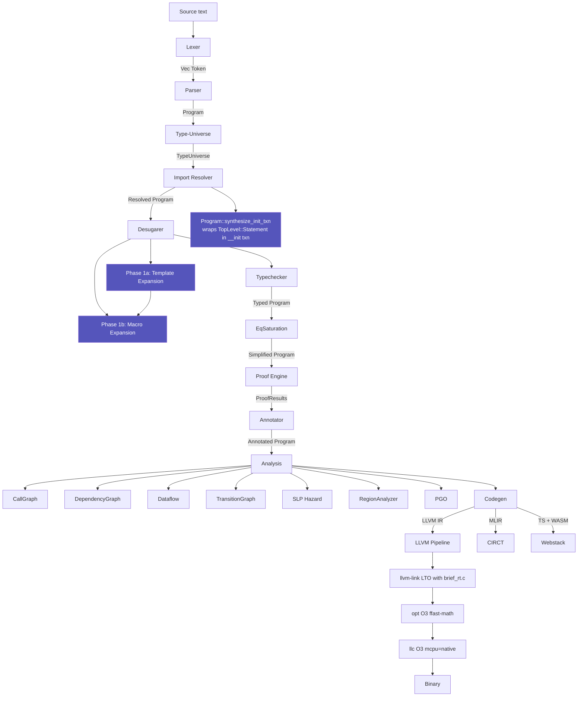
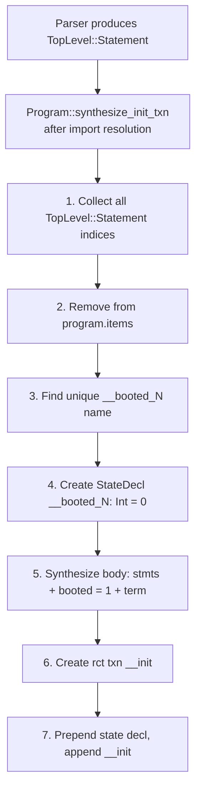
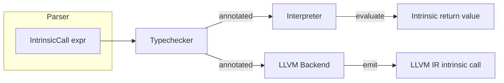
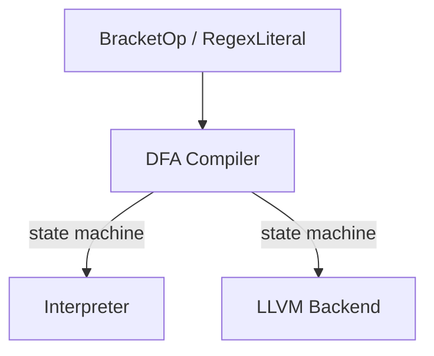
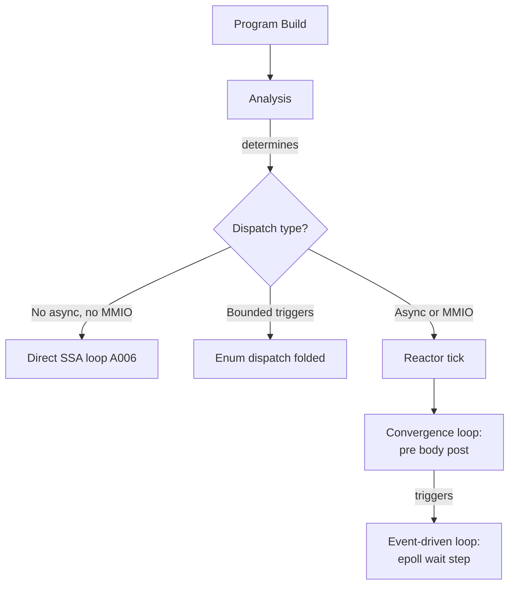
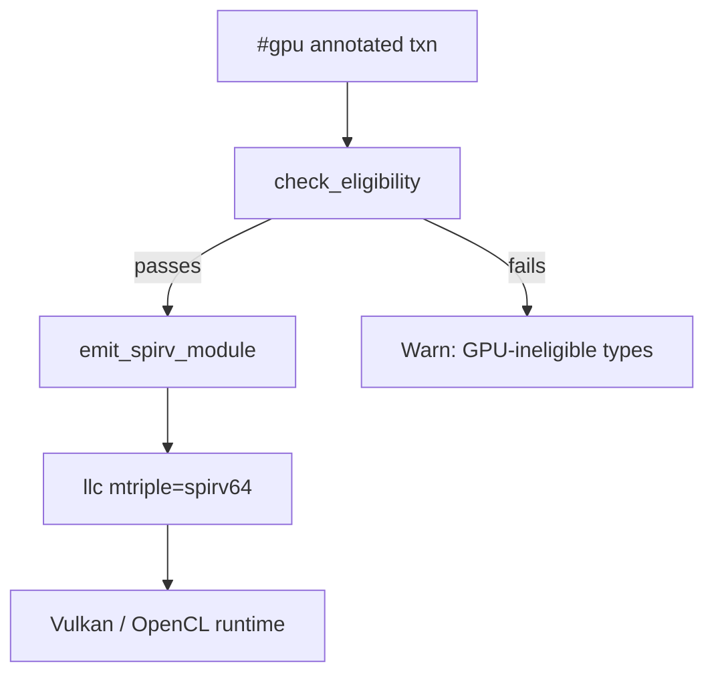

<!-- 2026-06-18 -->

# Channel Map — Data Flow Between Compiler Passes

## Pipeline



## Top::Statement Synthesis Flow



## IntrinsicCall Routing



## Universal Bracket Routing



## Import Target Routing (2026-06-19)

The `(wasm) import`, `(circt) import`, and `(javascript) import` syntaxes
set `Import.target` on the AST node:

| Syntax | `ImportTarget` | Webstack behavior | LLVM behavior |
|--------|----------------|-------------------|---------------|
| `import "path"` | `Native` | Inline as TS | Inline as LLVM IR |
| `(wasm) import` | `Wasm` | Queue for LLVM wasm32, base64-embed in TS | Compile to wasm32 |
| `(circt) import` | `Circt` | Error | Route to CIRCT backend |
| `(javascript) import` | `Javascript` | Inline JS from `wasm_impl` field | Error |

(WASM sidecar compilation is Phase B — pending wasm32 target support.)

```
Precondition failure in direct SSA loop:
  Before: br i1 %ok, label %body, label %skip_l → skip_l loops back to tick
  After:  br i1 %ok, label %body, label %done_{name} → done_{name}: br done

Body completion in direct SSA loop:
  skip_l: (still loops back to tick for normal iteration)
```

## loop_exit_label (2026-06-11)

```
Before body emission:  self.loop_exit_label = Some("done".into())
After body emission:   self.loop_exit_label = None

During body emission, TermBang handler checks loop_exit_label:
  If set: emit br label %done (instead of ret)
  If None: emit ret (original behavior, for non-loop contexts)
```

## Reactor / Async / Trigger Flow (2026-06-11)



## GPU Offloading Flow (2026-06-18)


