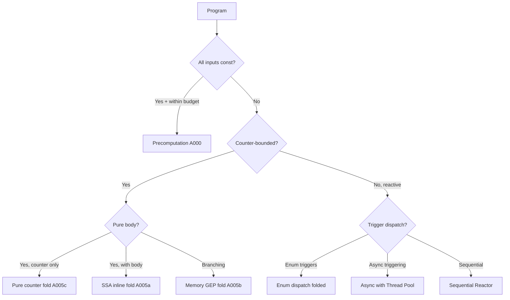

# Backend Dispatch (Optimization Path Selection)

**Date:** 2026-06-13
**Status:** Current

## Purpose

Select the optimal codegen strategy for each compiled program based on
program structure: loop bounds, FFI presence, and control flow branching.

## Decision Tree

The dispatch runs after typechecking in `mod.rs` `compile()`:

## Path Details

### A000: Precomputed
**File:** `loop_engine.rs:emit_precomputed_main`  
**Condition:** All inputs compile-time constant, iterations ≤ budget  
**Mechanism:** Interpreter simulates all loops, final state stored in single `store`  
**No phi, no loop, no SSA — just `main = { store; ret; }`**

### A001: Pure Counter Fold
**File:** `loop_engine.rs:emit_folded_pure_counter`  
**Condition:** Counter-bounded, pure body, compile-time constant bound  
**Mechanism:** O(1) store of final counter value. No runtime loop.  
**Gate:** `mod.rs:1066 — total_val.is_some()`

### A005a: Folded SSA Insertvalue
**File:** `loop_engine.rs:emit_folded_main(use_phi=false, body=Some(stmts))`  
**Condition:** Counter-bounded, non-pure body, NO branching OR provably linear  
**Mechanism:** 4× unrolled counted loop with `extractvalue`/`insertvalue` on `%State` + `phi %State` at guard merges  
**Gate:** `mod.rs:1082 — !body_has_branching(body) || prove_linear(body)`

### A005b: Folded Memory
**File:** `loop_engine.rs:emit_folded_memory_main` (2026-06-13)  
**Condition:** Counter-bounded, non-pure body, branching body NOT provably linear  
**Mechanism:** Counted loop with GEP+load+store on `%state`. No slot, no phi, no unrolling.  
**Gate:** `mod.rs:1084 — body_has_branching(body) && !prove_linear(body)`

### A005 (Phi Pipeline)
**File:** `loop_engine.rs:emit_folded_main(use_phi=true, body=None)`  
**Condition:** Counter-bounded, pure body, runtime-variable bound  
**Mechanism:** Counter-only phi pipeline. Calls `@txn(%State*)` inline.  
**Gate:** `mod.rs:1076 — is_effectively_pure`

### A006: Direct SSA Loop
**File:** `loop_engine.rs:emit_ssa_main`  
**Condition:** Not counter-bounded, no async/MMIO/triggers  
**Mechanism:** Tick loop with per-field GEP+load+store. Multiple txns supported.  
**Gate:** `mod.rs:1091 — !folded`

### Reactor Tick Loop
**File:** `dispatch.rs:emit_reactor` / `emit_parallel_reactor`  
**Condition:** Has async triggers or MMIO mappings  
**Mechanism:** Calls `@reactor_tick` in a loop via the runtime dispatch layer.

## Linearity Proof

`proof_engine.rs::prove_linear(body)` checks whether a transaction body
can have at most one guard then-path firing per iteration. Uses standalone
`check_satisfiable(a, b)` which compares each pair of guard conditions:

| Type | Example | Detection |
|------|---------|-----------|
| Bound contradiction | `[count < 5]` and `[count > 10]` | Same var, contradictory bounds via `extract_bound_from_expr` |
| Equality contradiction | `[count == 5]` and `[count == 10]` | Same var, different constant via `extract_eq_pair_from_expr` |
| Boolean contradiction | `[x]` and `[!x]` | Direct boolean via `is_truthy` pattern matching |

Returns `true` (satisfiable → NOT provably linear) conservatively when
no contradiction can be proven. Only returns `false` when DEFINITELY unsat.

## Why Three Paths (A005a, A005b, A006)

| Path | SROA Benefit | Dominance Safe | Complex Control Flow |
|------|-------------|----------------|---------------------|
| A005a (SSA insertvalue) | High (SROA promotes to scalars) | Yes (linear only) | No branching |
| A005b (memory) | Low (per-field GEP) | Yes (by construction) | Any branching |
| A006 (direct SSA) | High (emits GEP, mem2reg promotes) | Yes (memory-based) | Any branching + multiple txns |

The three paths exist because:
- **A005a** is the fastest for straight-line counted loops (benchmarks like
  fannkuch, nbody, knucleotide) — SROA eliminates the %State struct entirely.
- **A005b** handles counted loops WITH branching where SSA phi dominance
  would be violated. Slightly slower but correct for all programs.
- **A006** is the general-purpose tick loop for programs that don't fit the
  counted-loop pattern (multiple txns, triggers, MMIO).

## Files

| File | Lines | Role |
|------|-------|------|
| `src/backend/llvm/mod.rs` | 1736 | Dispatcher — decision logic at lines 1030-1140 |
| `src/backend/llvm/loop_engine.rs` | 978 | All counted-loop implementations (A001, A005a, A005b, phi pipeline, A006) |
| `src/proof_engine.rs` | 3600+ | `prove_linear`, `check_satisfiable`, `extract_bound/eq_pair` |
| `src/analysis/transition_graph.rs` | — | `is_counter_bounded` analysis |
