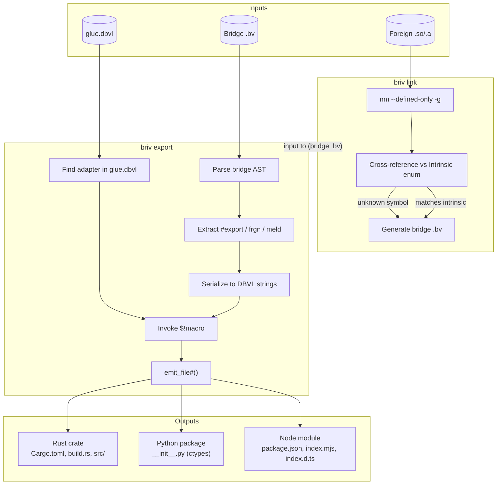

# GLUE Pipeline

## Flow Description

1. **`briv link <library>`** — Analyzes a foreign `.so`/`.a` via `nm`, extracts T (text) symbols, cross-references each against the compiler's `Intrinsic` enum. Known intrinsics become `intrinsic_call#()` wrappers; unknowns become `frgn` skeletons.

2. **`briv export <bridge.bv> <language>`** — Parses the bridge, extracts `#export`/`frgn`/`meld` declarations, serializes them as D-Briv Lines (bare comma-separated), looks up the language adapter in `glue.dbvl`, invokes the adapter's `$!macro`, which calls `emit_file#()` to write wrapper source files.

3. **Adapters** — Each language has a `.bv` `macro` at `glue/adapters/<lang>.bv`. The macro generates native source files without any Rust template engine. Adding a language = writing one `.bv` file.

4. **No C compiler** — The bridge emits LLVM IR → native `.o`/`.a`. The foreign language's linker (Rust's `rustc`, Python's `ctypes.CDLL`, Node's `WebAssembly.instantiate`) consumes it directly.
