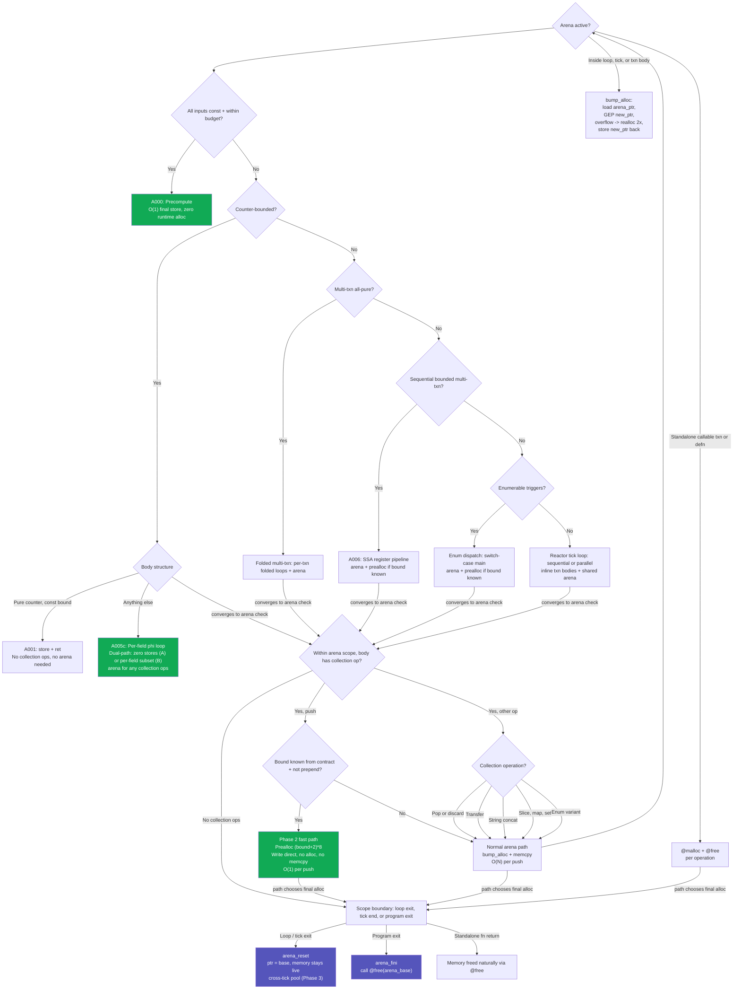

# LLVM Backend Memory Management

**Date:** 2026-06-23
**Status:** Current

## Principle

The LLVM backend's memory strategy is: **%State lives on the stack; heap
allocation is the exception, not the rule.** By keeping the entire program
state in a single `alloca %State` at `main()` entry, LLVM's `mem2reg` +
SROA can promote every field to an SSA virtual register, eliminating
memory traffic entirely for the common case. Heap allocation (`malloc`)
is reserved exclusively for runtime-sized dynamic structures (collections,
strings, enum variants).

Contracts (`[pre][post]`) are not a correctness tax — they provide the
bound and liveness information that enables every optimization below.
Without contracts, the compiler would need runtime guards; with contracts,
it proves at compile time what can live on the stack, what can be
scalarized, and what can be precomputed.

## 0. Allocation Strategy Overview

The compiler selects an allocation strategy per `Alloc#()` call site through
a three-layer dispatch system:

```
Layer 1: Phase 4 DAG analysis (pre-codegen)
  Builds a dataflow graph of each txn/defn body, traces every allocation
  through assignments/returns/calls, detects escapes (returned, stored to
  state, passed to foreign calls). Assigns strategy per analysis_id.

Layer 2: Explicit override (2nd arg to Alloc#)
  Alloc#(size, Arena)       — PascalCase: intrinsic strategy
  Alloc#(size, "pool_serial") — quoted string: config template
  Alloc#(size, my_alloc_fn)  — identifier: user Briv function

Layer 3: Default heuristics (no analysis, no override)
  Arena scope active       → arena bump allocate
  Bounded scope + no escape → stack alloca (with runtime fallback)
  Default                  → @malloc
```

**Strategies:**

| Strategy | Storage | Free# behavior | Best for |
|----------|---------|----------------|----------|
| `Inline` | Parent struct field | No-op | Fixed-size ≤8B, no escape (SSO/SVO) |
| `Alloca` | Stack frame | No-op | Fixed-size, bounded scope |
| `Arena` | Arena (bump) | No-op | Many allocs with same lifetime |
| `RingBuffer` | Circular buffer | No-op (overwrite) | Streaming, producer-consumer |
| `Malloc` | Heap | `@free` | Dynamic lifetime, escape |
| `Config(name)` | Custom template | Config-dependent | Application-specific pools |

### 0.1 Allocation DAG Analysis (Phase 4)

**File:** `src/analysis/allocation.rs`

A pre-codegen pass builds a dataflow DAG for each txn/defn body:

```
Node types: Alloc, Assign, Return, StateWrite, Call
Edges: via variable names (producer → consumer)

Forward trace: from each Alloc node through all consumer edges.
  If any reachable node is Return / StateWrite / Call → ESCAPED → Malloc
  If no escape path → default scope strategy (Arena / Alloca / Inline)
```

Three pillars:
1. **Draw predictable paths** — DAG builder traces every dataflow edge
2. **Fold predictable paths** — non-escaping allocs become Inline/Alloca/Arena
3. **Verify DAGs** — provenance tracking (`is_local_provenance`) confirms escapes

Post-processing applies Inline rule: ≤8B constant-size + no escape → Inline.

### 0.2 Runtime Fallback

For dynamic-size allocs with Alloca strategy, emit a runtime size check:

```llvm
%cmp = icmp ule i64 %size, 4096
br i1 %cmp, label %stack, label %heap
stack:
  %s = alloca i8, i64 %size
  br label %done
heap:
  %h = call ptr @malloc(i64 %size)
  br label %done
done:
  %v = phi i64 [ %s, %stack ], [ %h, %heap ]
```

The threshold is configurable via `BuildOptions.stack_threshold` (default 4096).

### 0.3 Thread-Safe Arena

When `has_async_txns` is true (parallel dispatch), the arena allocator uses
CAS (`cmpxchg`) for concurrent bump allocation:

```llvm
; Sequential: load + add + store (racy in parallel)
%cur = load ptr, ptr %arptr
%new = getelementptr i8, ptr %cur, i64 %size
store ptr %new, ptr %arptr

; Parallel: cmpxchg loop (atomic, correct)
retry:
  %cur = load ptr, ptr %arptr
  %new = getelementptr i8, ptr %cur, i64 %size
  %cas = cmpxchg ptr %arptr, ptr %cur, ptr %new monotonic monotonic
  %ok = extractvalue { ptr, i1 } %cas, 1
  br i1 %ok, label %done, label %retry
done:
  ; %cur is the allocation address
```

On overflow (arena exhausted), acquires a mutex through `__mutex_lock__` /
`__mutex_unlock__`, re-checks under lock, grows via `realloc` if needed.
The growth path is taken only on the rare case of arena exhaustion.

### 0.4 Config-Driven Free# Dispatching

`emit_free` reads the allocation strategy from the `alloc_strategies` map:

| Strategy | emit_free behavior |
|----------|-------------------|
| `Inline` | No-op |
| `Alloca` | No-op |
| `Arena` | No-op |
| `RingBuffer` | No-op |
| `Malloc` | `call @free(ptr)` |
| `Config(name)` | Checks config: `free = "none"` → no-op, `free = "fn"` → `call @fn(ptr)` |

Config entries in `config/alloc-strategies.dbvl` can declare a `free` field:

```toml
[alloc.pool_serial]
template = "call ptr @pool_alloc(i64 {size})"
free = "none"  # pool reuse — no per-element free
```

### 0.5 Garbage Scheduling (Global-Lifetime)

2026-08-01 (Phase D2): this is a garbage **scheduler**, not a collector —
the compiler PROVES, at compile time, the reactor-ordered last transaction
that touches each heap-backed state field, and emits a `Free#` (routed through
`@__briv_free`) exactly after that transaction's body. Design:
`docs/plans/2026-08-01-global-lifetime-design.md`.

- **The pass** (`analysis/global_lifetime.rs`): for each field whose
  initializer is a `Malloc#`/`Alloc#`, computes the touch set
  (new `collect_statement_identifiers`) and the last ordered consumer in the
  transition graph's deterministic firing order. Conservative: a field with no
  provable last consumer is NOT freed (lives for the program).
- **Emission**: the countdown emits the scheduled frees in its exit block
  (`.cde_`, before `ret`), after the whole loop; the non-loop path emits them
  after the body. The handle is the field's STORED value loaded from `%State`
  (re-evaluating the initializer would re-malloc).
- **Soundness**: a field freed but touched later is structurally impossible
  (the scheduler only frees after the last ordered touch); **manually-freed
  fields are excluded** (a manual `Free#`, a `free x;`, or a `keep x;` + a
  scheduled free = double-free).
- **Calibration**: scheduled frees route through `__briv_free` (a runtime
  counter + `free`) so a test can assert frees == allocs via
  `__briv_free_count()`. `@__briv_free` is declared `argmemonly` (it only
  touches the pointer's memory) so a scheduled free doesn't clobber the module.
- **Observability as liveness**: the scheduled free makes the freed field's
  memory OBSERVABLE — dead table writes that a C compiler would eliminate stay
  alive in Briv. Benchmarks must be honest on BOTH sides (a read-modify-write
  whose RHS reads a previously-written slot keeps the C reference honest too).

### 0.6 The Free-Check — `free`/`keep` hints + consume destroys (Phase 5)

2026-08-01 (Phase 5): the garbage scheduler is extended with developer-facing
lifetime control and the consumptive-operators' runtime destroy. Design:
`docs/plans/2026-08-01-free-check.md`.

- **`free x;`** (`Statement::FreeHint`) — a VERIFIED contract: the backing of
  `x` is freed here. The typechecker marks `x` dead (a later read is a
  use-after-free error); the codegen emits the strategy-aware free
  (`emit_destroy_register`: only tracked Malloc/Custom backings are `@free`d;
  inline/arena/scalar backings are no-ops); the scheduler excludes `x` from its
  auto-free.
- **`keep x;`** (`Statement::KeepHint`) — SUPPRESS the scheduler's auto-free of
  `x` (it escapes). A `keep` on a field the scheduler would not free anyway is
  a redundant-keep warning (analysis → backend `warnings()`).
- **Consumptive destroys** (`Expr::Consume`) — `a ~= b`, `a ~+ b`,
  `dest ~<- src`, `~<- src;` record the consumed register in
  `pending_consumes`; `emit_statement_sequence` drains it at the statement
  boundary via `emit_destroy_register`. Scalars/unknown strategies are never
  freed (a scalar's value is not a pointer).
- **`brivc memcheck <file.bv>`** — the diagnostics subcommand: per heap-backed
  field, whether the scheduler proved a last use (and after which txn) or the
  field lives for the program, plus redundant keeps.
- **Refcount (not implemented)**: a per-fire decrement refcount is UNSOUND for
  multi-fire transactions (over-counts → premature free); the sound fallback is
  the developer-verified `free x;`.

## 1. Foundation: Stack-Allocated State

Every `main()` entry allocates `%State` via `alloca`:

```llvm
%state = alloca %State, align 8
```

Sources:
- `src/backend/llvm/loop_engine.rs:553` (folded main)
- `src/backend/llvm/loop_engine.rs:606` (folded memory main)
- `src/backend/llvm/loop_engine.rs:678` (SSA main)
- `src/backend/llvm/loop_engine.rs:1285` (pure counter)
- `src/backend/llvm/emit_toplevel.rs:1374` (init_state body)

### 1.1 `noalias nocapture` — Critical SROA Enabler

Every function that receives `%State*` annotates it as
`ptr noalias nocapture`:

- `emit_toplevel.rs:710` — generic state parameter emission
- `emit_toplevel.rs:1124` — precondition functions (`@pre_*`)
- `emit_toplevel.rs:1149` — async body functions
- `emit_toplevel.rs:1182,1223` — fused and composed functions
- `dispatch.rs:26,139` — `reactor_tick` (sequential and parallel)
- `loop_engine.rs:1306` — `step()` function (trg dirty-flag path)

The `noalias` attribute tells LLVM's alias analysis passes that no other
pointer aliases `%State`, enabling GVN to eliminate redundant loads.
The `nocapture` attribute tells LLVM the pointer never escapes — all
uses are within the function, enabling SROA to decompose `%State` into
scalars. Without these attributes, the entire stack-based strategy
collapses (`mod.rs:416-430`).

### 1.2 Path Selection Tree

> **2026-07-31 (frontend-driven dispatch):** the tree below is the legacy
> heuristic dispatch. Since Phase 1b the DECISION is computed once in the
> frontend (`AnalysisResults` / `LoopShape`) and the backend merely consumes
> it — see `docs/plans/2026-07-31-frontend-driven-dispatch.md` §5-§6 and
> `docs/architecture/backend-architecture.md` §5. The periodic-guard paths now
> go through the **countdown loop** (`loop_engine/counter.rs:
> emit_countable_countdown_main`) or the version-DAG; the per-field phi loop
> remains for non-periodic bounded loops.

The backend selects a codegen strategy at `mod.rs:2162-2190` by walking
a decision tree: all-const inputs within budget → precompute; else check
single foldable txn → pure counter or A005c per-field phi loop; else
A006 direct SSA pipeline; else reactor tick loop.

| Code | Condition | Memory Strategy |
|------|-----------|-----------------|
| **A000** | All-const inputs within budget | No runtime loop — `GEP + store` per final value. `loop_engine.rs:emit_precomputed_main` |
| **A005c** | Counter-bounded, any body (pure or non-pure) | Per-field phi loop. One phi per state field. Dual-path: **Path A** (no stores in body) or **Path B** (per-field subset stores for `done:` block). `loop_engine.rs:emit_countable_main` |
| **A006** | Sequential bounded multi-txn | Per-field GEP pre-load, direct SSA loop with phi induction. `loop_engine.rs:emit_ssa_main` |

A005a (struct-SSA insertvalue), A005b (memory GEP counter), and A005d
(memory loop for >8 fields) have been removed. A005c now handles ALL
countable-loop field counts. Chunk allocas (≤15 fields per chunk) let
SROA decompose even 31-field states into scalar phis — zero memory
traffic with Path A.

### 1.3 Counter Phi Structure

The counter phi is the induction variable that drives every counted loop
(A005c). It uses a per-field phi structure:

```llvm
loop_hdr:        ; header
  %cnt = phi i64 [ %init, %pre_phi ], [ %cnt_next, %latch ]
  %x0 = phi float [ %init_x0, %pre_phi ], [ %be_x0, %latch ]
  ; ... one phi per field
  %cmp = icmp slt i64 %cnt, %bound
  br i1 %cmp, label %body, label %done
body:
  ; compute using phi registers — zero memory traffic (Path A)
  ; or GEP+store (Path B)
  br label %latch
latch:
  %cnt_next = add i64 %cnt, 1
  %be_x0 = fadd float %new_x0, 0.0
  ; ... one backedge per field
  br label %loop_hdr, !llvm.loop !N
done:
  ; arena cleanup + optional hoisted prints + ret
```

### 1.4 Pre-extraction

`phi_regs_to_ssa_old()` (`loop_engine.rs:1027-1040`) copies phi register
names into `ssa_old_float_regs` and `ssa_old_int_regs` at the A005c body
start. Subsequent statement emission reads from these caches instead of
GEP+loading from `%State`. This eliminates all memory traffic from field
reads in the hot loop.

When `parallel_safe_body` is enabled, `emit_memory_field_store` does NOT
update these caches after `&` assignments — keeping phi registers for ALL
reads so computations become independent.

### 1.5 Per-Field GEP Loading (Memory Path)

`pre_load_all_fields()` (`loop_engine.rs:431-446`) loads state fields at
tick entry via per-field `GEP`:

```llvm
%gep_X = getelementptr inbounds %State, ptr %state, i32 0, i32 <field_idx>
%X_old = load <ty>, ptr %gep_X, align <N>, !tbaa !<N>
```

Accepts an optional `filter: Option<&HashSet<String>>` for per-field
liveness. When `emit_hoisted_post_loop_prints` calls it, only the fields
in `done_needs_fields` are loaded — avoiding unnecessary GEP+load for
fields the hoisted print doesn't reference.

Identifier expressions read from `ssa_old_*_regs` (populated by
`pre_load_all_fields` or `phi_regs_to_ssa_old`) directly — zero memory
traffic for the hot path.

## 2. Small String Optimization (SSO)

**Feature flag:** `feature_sso_strings` (default false, gated behind CLI)

When enabled, `String` becomes a `{ i64, i64 }` struct instead of a single
heap pointer:

```
Handle layout:
  handle[0] = packed data (≤6 bytes) << 3 | tag (SSO=0b001)  — inline
           or ptrtoint & -8                                    — heap
  handle[1] = byte length (both inline and heap)

Tag bits (lower 3 bits of handle[0]):
  000 = heap pointer
  001 = SSO inline (≤6 bytes stored in handle[0] >> 3)
  010 = static literal (reserved)
  100 = temporary heap (allocated in txn, freed at tick end)
```

### 2.1 State Layout

When SSO is ON, `push_field_type` pushes 2 consecutive i64 slots per
String field (instead of 1). The `field_index_map` entry points to slot 0;
slot 1 is implicitly at index+1. State load/store emits `extractvalue`/
`insertvalue` on the `{i64, i64}` struct.

### 2.2 Literal Emission

Short strings (≤6 bytes) are packed inline:
```llvm
%t0 = or i64 <packed_bytes << 3>, 1   ; data + SSO tag
%t1 = insertvalue { i64, i64 } undef, i64 %t0, 0
%t2 = insertvalue { i64, i64 } %t1, i64 <len>, 1
```

Long strings (>6 bytes) use a stack-allocated buffer with ptrtoint
(no 16-byte heap header — the SSO SSO format doesn't use one).

### 2.3 Concat

When SSO is ON and `a_len + b_len ≤ 6`, both operands are SSO inline.
The concat packs both into a new SSO handle:
```llvm
%a_data = lshr i64 %a_dtag, 3           ; extract inline data
%b_data = lshr i64 %b_dtag, 3
%shifted = shl i64 %b_data, %a_len_8   ; position b after a
%combined = or i64 %a_data, %shifted
%new_tag = shl i64 %combined, 3 | 1    ; new SSO handle
```

When total > 6, allocates raw heap buffer (no header), copies both
sources, null-terminates. Returns heap handle.

## 3. Small Vector Optimization (SVO)

**Feature flag:** `feature_svo` (default false)

Extends the SSO inline-storage pattern to `List<T>`. When SVO is ON and
the type has `op.SVO <~ N` metadata (e.g., `svo <~ 3` on List), the
`List<T>` handle becomes an N+1 slot struct:

```
Handle layout (cap = 3):
  slot[0..cap-1] = element values (i64 each)
  slot[cap]      = (len << 32) | (cap << 32) | 1  (tag bit 0 = inline)

Tag bit 0 of slot[cap]:
  1 = inline (elements in slots 0..cap-1)
  0 = heap (slot[0] = ptrtoint, slot[1] = len, slot[2] = cap)
```

### 3.1 State Layout

`push_field_type` pushes `cap + 1` slots for vector-like types.
The `llvm_type` override returns `{ i64, i64, ..., i64 }` (N+1 slots).

### 3.2 List Literal Emission

Small list literals (≤3 elements) emit inline handles via `insertvalue`:
```llvm
%t0 = insertvalue { i64, i64, i64, i64 } undef, i64 10, 0  ; elem 0
%t1 = insertvalue { i64, i64, i64, i64 } %t0, i64 20, 1   ; elem 1
%t2 = insertvalue { i64, i64, i64, i64 } %t1, i64 30, 2   ; elem 2
%tag = add i64 0, <(3<<32)|(3<<32)|1>                       ; len|cap|tag
%t3 = insertvalue { i64, i64, i64, i64 } %t2, i64 %tag, 3   ; tag slot
```

### 3.3 Indexing

SVO indexing uses a stack array + GEP for dynamic indices (extractvalue
requires constant indices):

```llvm
; Copy inline data to stack array
%arr = alloca [3 x i64], align 8
%slot0 = extractvalue { i64, i64, i64, i64 } %handle, 0
store i64 %slot0, ptr %arr_gep0
; ... (repeat for slots 1, 2)

; Check tag branch
%tag = extractvalue { i64, i64, i64, i64 } %handle, 3
%is_inline = and i64 %tag, 1
br i1 %is_inline, label %inline, label %heap

inline:
  %gep = getelementptr [3 x i64], ptr %arr, i64 0, i64 %idx
  %val = load i64, ptr %gep

heap:
  %ptr = extractvalue { i64, i64, i64, i64 } %handle, 0
  %hgep = getelementptr i64, ptr %ptr, i64 %idx+1
  %val = load i64, ptr %hgep
```

## 4. Precomputation (A000)

When the region analyzer proves the entire program is precomputable within
`--optimize-budget`, `emit_precomputed_main()` (`emit_expr.rs:4448-4485`)
emits a `main()` with **no runtime loop at all**:

```llvm
define i32 @main() {
  %state = alloca %State, align 8
  call void @init_state(ptr %state)
  %gp_counter = getelementptr inbounds %State, ptr %state, i32 0, i32 2
  store i64 50000000, i64* %gp_counter    ; O(1) final value
  ret i32 0
}
```

This is the most extreme memory optimization: **zero runtime memory traffic
because there is no runtime.** Detection at `mod.rs:1243-1260`:
`analysis.region_analyzer.is_fully_precomputable(self.optimize_budget)`.

When the budget is exceeded but no FFI exists in the hot path, the compiler
warns "budget exceeded by composed chain product" and falls through to a
runtime loop. When FFI exists, it warns "FFI calls prevent compile-time
evaluation."

---

## 3. Composed Chain Folding

Chains of reactive transactions that are **all-internal** (no FFI, no
external triggers) have their final counter values stored directly as
O(1) stores inside enum dispatch case arms rather than calling a folded
loop (`mod.rs:1704-1718`):

```llvm
case_trg_1:     ; trigger value = 1
  store i64 10, i64* %counter    ; all-internal: store and done
  ret i32 0
case_trg_2:     ; trigger value = 2
  store i64 20, i64* %counter
  ret i32 0
```

Non-all-internal chains get `emit_fused_composed()` (`emit_toplevel.rs:1221-1231`).

---

## 4. Fused Transactions

`resolve_fusable_pairs()` (`emit_expr.rs:4538-4557`) detects adjacent
reactive transactions with: no async, both reactive, disjoint write sets,
no trigger-gated preconditions. `emit_fused()` (`emit_toplevel.rs:1176-1191`)
concatenates their bodies into a single function with a single
`%State* noalias nocapture` parameter, reducing `reactor_tick` dispatch
overhead.

---

## 5. Dispatch Mode Selection & Memory

`select_optimization_strategy()` (`optimizer.rs:30-46`) is the decision hub.

### 5.1 Sequential Reactor

`emit_reactor()` (`dispatch.rs:8-75`): evaluates all preconditions up front
(`%pr0`, `%pr1`, ...), branches to each txn body in order. No additional
memory beyond `%State`.

### 5.2 Parallel Reactor with `%fired_mask`

`emit_parallel_reactor()` (`dispatch.rs:120-217`): adds `alloca i64` for
`%fired_mask` — a bitmask tracking which fields have been written by
previously-fired parallel txns:

```llvm
%fired_mask = alloca i64, align 8
store i64 0, i64* %fired_mask
; Before each txn: check mask
%fm = load i64, i64* %fired_mask
%ca = and i64 %fm, <write_mask>           ; check conflict
%nc = icmp eq i64 %ca, 0
%can = and i1 %pr, %nc                    ; pre AND no conflict
br i1 %can, label %body, label %skip
; After each txn: update mask
%fm2 = load i64, i64* %fired_mask
%fm3 = or i64 %fm2, <write_mask>
store i64 %fm3, i64* %fired_mask
```

The mask is 8 bytes on the stack. `build_write_masks()` (`dispatch.rs:103-117`)
precomputes bitmasks from `field_index_map`.

### 5.3 Enum Dispatch

When trigger value sets fit within `optimize_budget`, the backend generates
a switch-case main with per-key folded loops. Each case arm shares the same
`%State` alloca. All-internal chains store final counter values directly
(section 3).

### 5.4 Async / Thread Pool

Per-worker `%State*` passed to `async_body_*` functions, each with
`noalias nocapture`. Thread pool metadata via `emit_thread_pool_metadata()`
(`emit_expr.rs:4510-4519`).

---

## 6. Heap Allocation (Dynamic Structures Only)

`malloc` is used only for runtime-sized data:

| Use | Location | Pattern |
|-----|----------|---------|
| List headers (slice results) | `emit_expr.rs:3314` | `@malloc((len+2) * 8)` — 2-slot header + elements |
| Map/Set literals | `emit_expr.rs:3500,3525` | `@malloc((n+2) * 8)` — header + key-value pairs |
| `<-` arrow push | `emit_expr.rs:3572` | `@free(old)`, `@malloc((len+3) * 8)`, `@llvm.memcpy`, store |
| `<-` arrow pop | `emit_expr.rs:3664` | `@free(old)`, `@malloc((len+1) * 8)`, memcpy before/after |
| `<-` arrow discard | `emit_expr.rs:3740` | Same as pop, element not loaded |
| `<-` arrow transfer | `emit_expr.rs:3825` | Combined buffer `(dest_len+src_len+2)*8` |
| Enum variant construction | `emit_expr.rs:563` | Tagged union via `@malloc` |
| String concat | `emit_expr.rs:4764` | `@malloc(header + total_chars + 1)`, memcpy A + B |

### 6.1 Collection 2-Slot Header Format

All heap-allocated collections use the same layout:

```
slot 0: data_ptr (i64) — pointer to first element
slot 1: length (i64)
slot 2..N: elements (i64 each)
```

String constants mirror this format: emitted as `<{ i64, i64, [N x i8] }>`
structs with `data_ptr` pointing to the chars field, making static strings
indistinguishable from heap strings at the pointer level (`mod.rs:1641-1649`).

### 6.2 Embedded Mode Ban

Embedded targets (`.ebv`/`.sebv`) ban all heap allocation. `check_embedded_restrictions()`
(`mod.rs:1059-1099`) warns if any state, let-binding, or expression uses
`Type::String`, `Type::Data`, or any collection type.

## 7. String Concat Optimization

### Detection (`is_string_chain`, `emit_expr.rs:4986-5018`)

Recursively detects if a `+`/Concat expression chain produces a string,
checking: literal strings, identifiers (against type bindings), `Call` results
(against `defn_return_types`), and `Cast` to String/Data.

### Inline Expansion (`emit_inline_concat`, `emit_expr.rs:4728-4836`)

Emits **no runtime library calls**:
1. Mask tag bits (bit 0 = static constant, bit 1 = temporary) from operands
2. Load lengths from header slot 1
3. `@malloc(header_size + total_chars + 1)` — tight packing
4. Write data_ptr, total length into result header
5. `@llvm.memcpy` operand A chars, then operand B chars at offset len_A
6. Null-terminate
7. Check bit 1 of each operand — if set (temporary), `@free` it. Static
   constants (bit 0) and state-owned strings (both bits clear) preserved.
8. Tag result with bit 1 set

## 8. TBAA Metadata

A 6-node TBAA type tree (`mod.rs:448-457`):

```
!0 = !{!"Briv"}        — root
!1 = !{!"Int", !0}      — i64-stored values
!2 = !{!"Bool", !0}     — i1/i8-stored Bool
!3 = !{!"Char", !0}     — i32-stored Char
!4 = !{!"String", !0}   — i8*-stored String
!5 = !{!"Float", !0}    — float-stored Float
```

Annotated on every state field load/store and collection element access
(~80 sites across `emit_expr.rs`, `emit_stmt.rs`, `loop_engine.rs`). Even
though all boxed types are stored as `i64` in `%State`, TBAA lets LLVM
disambiguate accesses by logical type for GVN and load elimination.

## 9. `!range` & `@llvm.assume`

Contracts inform LLVM's optimizer at two levels.

### `!range` metadata (preferred)

For simple `[x < N]` precondition patterns (`emit_toplevel.rs:1093-1119`):

```llvm
%prl = load i64, i64* %gep, align 8, !tbaa !1, !range !{ 0, 100 }
```

LLVM uses this to infer `nuw`/`nsw` on arithmetic, enabling induction
variable strength reduction and loop optimizations.

### `@llvm.assume` fallback

For complex patterns (compound conditions, non-Lt forms,
`emit_toplevel.rs:1110-1117`):

```llvm
%cond = icmp ne i64 %expr, 0
br i1 %cond, label %safe, label %panic
panic:
  unreachable
safe:
  call void @llvm.assume(i1 %cond)
```

The `br ... unreachable` path prevents execution on contract violation.
The `@llvm.assume` constrains the optimizer for downstream passes (GVN,
LICM, SROA). Both together: correctness at runtime, optimization at
compile time.

## 10. Dead-Field Elimination

`apply_field_modes()` (`mod.rs:2622-2696`) runs after the transition graph
is built:

1. **Assign modes**: each field is `Always`, `LazyCached`, or `Never`
2. **Always**: triggers, cell fields, param slots — unconditionally kept
3. **Never**: physically removed from `field_index_map` and `field_types` —
   `%State` struct shrinks
4. **LazyCached**: appended cache slots (one `i64` for cached value + one `i8`
   valid flag per projection target). Computed lazily via `try_cached_projection()`
   (`emit_expr.rs:5213-5272`) — load valid flag → branch → hit loads cache,
   miss computes, stores, sets valid, phi merge.

Driven by `live_fields` from the transition graph (`mod.rs:1344-1346`).

## 11. Projection Fast-Path

`try_projection_fast_path()` (`emit_expr.rs:5023-5208`) emits native LLVM IR
for 45+ `UserDefinedWithArg` operator/type pairs (`Add`, `Sub`, `Mul`, `Div`,
`Eq`, `Ne`, `Lt`, `Le`, `Gt`, `Ge`, `BitAnd`, `BitOr`, etc.):

- **`Type::Int`**: `add`/`sub`/`mul`/`sdiv`/`icmp` + `zext`
- **`Type::Float`**: `fadd`/`fsub`/`fmul`/`fdiv`/`fcmp` + `zext`
- **`Type::Bool`**: `and`/`or`/`icmp eq`/`icmp ne`

No boxing through i64. Called from the projection dispatch at
`emit_expr.rs:2768`.

## 12. No LLVM Struct Types

User-defined structs are never emitted as LLVM `%MyStruct = type { ... }`.
`struct_types` (`mod.rs:661`) stores field metadata for offset arithmetic only.
`FieldAccess` uses raw `getelementptr i64, i64* %base, i64 <offset>`
(`emit_expr.rs:2700-2722`). `StructInstance` allocates `alloca i64, i64 N` and
stores at computed GEP offsets. This avoids LLVM struct-type rigidity and keeps
SROA decomposition trivial.

## 13. Instruction Reordering

`reorder.rs` builds a dependency DAG from statement read/write sets and
applies Kahn's topological sort to group independent statements for
maximum instruction-level parallelism (ILP). Terminators are always placed
last. Bodies with < 3 statements skip reordering. Cycle detection falls
back to original order.

### Kahn's Topological Sort

Kahn's algorithm orders a DAG so every edge goes forward — no statement
appears before something it depends on. For Briv's reorder pass, each
transaction body statement is a node, and edges are **data dependencies**:

| Edge | Name | Meaning |
|------|------|---------|
| `A → B` | RAW (read-after-write) | B reads what A wrote |
| `A → B` | WAW (write-after-write) | Both write the same field |
| `A → B` | WAR (write-after-read) | B writes a field A just read |

The algorithm:

1. Compute in-degree (incoming edge count) for each statement
2. Enqueue all statements with in-degree 0 (no blockers)
3. Pop one, emit it, decrement in-degree of every statement depending on it
4. If any of those now have in-degree 0, enqueue them
5. Repeat until the queue is empty — the emission order is the result

If the queue empties before all statements are emitted, a cycle exists
and the pass falls back to the original order. Otherwise the result is a
schedule where independent statements (no connected edges) appear in
parallel-friendly groups — LLVM's scheduler can then fill execution ports
simultaneously.

### Comparison: Briv vs Forth

This is nearly the opposite of how Forth sequences operations:

| Forth | Briv |
|-------|-------|
| Data flows through implicit stack. Programmer sequences words manually; stack order *is* the data flow. | Data flows through explicit SSA registers. Compiler builds a dependency DAG, then reorders. |
| Sequence is the *constraint* — stack position defines which value an operator consumes. | Sequence is the *output* — dependencies were already resolved in the DAG. The linear emit is just one valid schedule. |
| ILP requires the programmer to manually stack-juggle. | ILP comes from automatic reordering of independent operations. |
| No analysis — the programmer *is* the compiler. | Full dependency analysis — the compiler *is* the scheduler. |

A better analogy than Forth: Briv's reorder pass is like a
**superscalar processor's out-of-order scheduler**. It takes a sequential
program, builds a data-flow graph, then emits a new sequence that respects
all dependencies while maximizing distance between independent operations.
Forth never has the graph — its sequence *is* the only representation.

### Comparison: Microsoft Profile-Guided Basic Block Reorderer

Microsoft's PGO Basic Block Reorderer (late-90s/early-2000s, used in
the Windows NT kernel and Visual C++ linker) solved a related but distinct
problem: given execution frequency data from profiling runs, reorder the
basic blocks within a function so that hot paths fall through linearly
and cold paths branch out-of-line. The goal was **I-cache locality** and
**branch prediction** — keeping the common case compact and contiguous.

Both reorderers share the premise that *"the programmer's linear sequence
is not optimal; the compiler can pick a better one"*, but the optimization
domains differ:

| | Microsoft PGO Block Reorderer | Briv Kahn sort |
|---|---|---|
| **Input** | Profile data (execution frequency from real runs) | Static data dependencies (RAW/WAW/WAR) |
| **Unit** | Basic blocks within a function | Statements within a transaction body |
| **Goal** | I-cache locality + branch prediction (memory hierarchy) | ILP — group independent ops for superscalar execution |
| **Technique** | Weighted CFG placement driven by edge frequencies | Topological sort of dependency DAG |
| **Effect** | Hot path falls through; cold path is out-of-line | Wider reservation stations, more µop parallelism |

One optimizes **which blocks live next to each other in memory**; the
other optimizes **which instructions can execute in parallel**. The shared
idea — that the compiler should reorganize the programmer's sequence
based on richer information — applies at both granularities.

## 14. SLP Hazard Analysis

`hazard.rs` prevents SLP vectorization when register pressure would exceed
hardware capacity:

- `compute_peak_live_floats()` — interval analysis for peak register demand
- `target_hardware()` — maps target to (register_count, vector_width):
  AVX512 = 32/16, AVX2 = 16/8, NEON = 32/4, SSE = 16/4
- Disables SLP when peak demand ≥ available registers, or when
  ops-per-field ratio < 1.5 (too many shuffles for too few ops)
- `optimal_unroll_factor()` selects 1, 4, or 8 based on pressure

## 15. Native Type Mapping

`TypedRegister::llvm()` (`mod.rs:179-188`) maps each Briv type to its
native LLVM type:

| Briv | LLVM |
|-------|------|
| `Bool` | `i1` |
| `Char` | `i32` |
| `Int` | `i64` |
| `Float` | `float` |
| `String` | `i8*` |

This avoids boxing everything to `i64`, enabling native register operations.
Float register caching (`emit_toplevel.rs:166-189`) prevents redundant
`trunc`+`bitcast` sequences for boxed→native float conversion.

## 16. Constant Deduplication

Constant globals are deduplicated by value (`mod.rs:1538-1627`). Identical
constants map to the same global via `@alias`, reducing cache line pressure.

---

## 17. GPU Memory Model

When a `#gpu`-annotated transaction is extracted, the memory model shifts
fundamentally — there is **no `%State` alloca**. Instead, `emit_spirv_module()`
(`gpu.rs:357-446`) emits a `spir_kernel` function with storage buffers:

```llvm
define spir_kernel void @kernel(i8* nocapture readonly %in_buf,
                                i8* nocapture %out_buf, i64 %N)
```

- **`%in_buf`**: read-only buffer (state at tick start)
- **`%out_buf`**: write buffer (state after tick)
- **`%print_buf`**: optional I/O buffer (when `print_int#` exists)
- **Global work-item ID**: `%gtid = call i64 @_Z13get_global_idj(i32 0)`
- **Field access**: `getelementptr i8, i8* %base_in, i64 <offset>`

Shared memory uses `addrspace(3)` globals (`gpu.rs:396-402`):

```llvm
@shared_buf_0 = internal addrspace(3) global [256 x i64] zeroinitializer
```

Memory eligibility (`check_eligibility`, `gpu.rs:54-122`) restricts GPU
kernels to Int, Float, Bool, Char — no strings, structs, enums, or
collections. SPIR-V compilation via `llc --mtriple=spirv64-unknown-unknown`
(`gpu.rs:1038-1071`).

---

## 18. Reactive Dirty-Flag System (trg `step()`)

`emit_trg_step()` (`loop_engine.rs:1299-1441`) emits a `@step()` function
that implements the reactive dirty-flag architecture:

```llvm
define void @step(ptr noalias nocapture %state, i64 %dirty_in) {
  %dirty_slot = alloca i64, align 8
  store i64 %dirty_in, i64* %dirty_slot

  ; Volatile-load all triggers (liveness anchor)
  %gtrg = getelementptr %State, ptr %state, i32 0, i32 <trg_idx>
  %ltrg = load volatile i64, i64* %gtrg
  store volatile i64 %ltrg, i64* %gtrg

  ; For each non-trg variable in topological order:
  %ld = load i64, i64* %dirty_slot
  %and = and i64 %ld, <dep_bitmask>
  %cmp = icmp ne i64 %and, 0
  br i1 %cmp, label %recompute, label %skip

recompute:
  %gdep = getelementptr %State, ptr %state, i32 0, i32 <dep_idx>
  %ldep = load i64, i64* %gdep
  store i64 <new_val>, i64* %gdep
  br label %skip

skip:
  store i64 0, i64* %dirty_slot           ; clear mask
  ret void
}
```

Memory impact: one `alloca i64` per `step()` call, plus `load volatile`/
`store volatile` on every trigger field every tick. This ensures liveness
and correctness at the cost of barrier instructions preventing LLVM from
optimizing trigger reads.

The event loop (`emit_trg_event_epoll_wait`, `loop_engine.rs:1446-1555`)
calls `epoll_wait`, reads per-trigger data, sets dirty bits, then `step()`.

---

## 19. Optimization Directives

`directive.rs` resolves `#gpu`, `#inline`, `#unroll`, `#vectorize`
directives into `DirectiveEffect` values. Memory impact:

- **`#gpu`**: shifts from `%State`-on-stack to SPIR-V storage buffers
  (section 17)
- **`#inline`** / **`#unroll`** / **`#vectorize`**: emit `!llvm.loop`
  metadata affecting LLVM's SROA, SLP, and mem2reg behavior

---

## 20. Arena Allocation

**Status:** Implemented (2026-06-23) — three phases complete.

Phase 1 replaced per-operation `@free(@malloc(...))` in collection and
string operations with a per-scope bump arena. Phase 3 extended this to
keep arena pages alive across loop/ticks (pointer reset instead of free).
Phase 2 added contract-driven preallocation: when a loop bound is known,
the collection buffer is preallocated at full capacity, and `<- push`
writes directly without allocation or memcpy.

### Phase 1: Per-Tick Bump Arena

Every loop/tick body allocates a 64KB arena at entry (mod.rs:1121-1144,
loop_engine.rs:657,726,807). All `<- push/pop/discard/transfer`, string
concat, slice, map/set, and enum allocations use `emit_arena_alloc()`:

- **Arena active** (inside any loop/tick scope): bump-allocate from arena.
  Overflow triggers `@realloc` (grow 2x, min 64KB). No per-operation free.
- **Arena inactive** (standalone callable txns, defns): fall back to `@malloc`.

`emit_arena_alloc()` emits the inline bump sequence (load ptr, compute new
pointer, overflow check, phi-merge hit/grow, store new ptr). The `@realloc`
path is rarely exercised — 64KB accommodates typical per-tick patterns.

Files: `mod.rs:1102-1120` (emit_arena_alloc), `mod.rs:1121-1144` (init),
`mod.rs:1165-1175` (fini), `emit_expr.rs` (12 call sites).

### Phase 2: Contract-Driven Capacity Preallocation

When a bounded loop (e.g., `[i < N] { &list = list <- i }`) is detected
by the foldable analysis, the compiler preallocates a single full-size
buffer at loop entry and records the capacity in `field_prealloc_info`.

The emission sites are:
1. **Loop entry** (emit_folded_main, emit_folded_memory_main): calls
   `emit_prealloc_for_body()` which scans the body for `<- push` targets,
   allocates `(bound+2)*8` bytes per target from the arena, initializes
   the 2-slot header (data_ptr + length=0), stores the buffer to the
   state field, and records (capacity_reg, buf_i64) in the map.
2. **`<- push`** (emit_expr.rs ArrowMut::Push): checks `field_prealloc_info`.
   If found and `len < capacity`, writes the element directly at
   `buf_i64[2 + old_len]`, increments `buf_i64[1]`, stores buffer ptr to
   state. No allocation, no memcpy, no free — O(1) push.

This transforms bounded-list-building loops from O(N²) element copies
(1+2+...+N) to O(N) (N direct stores). The memcpy at each iteration was
the hidden quadratic cost — now dead.

Only append-style pushes (`ArrowDir::Push` without prepend) are optimized.
Prepend still follows the normal arena path. If capacity is exceeded
(contract violation during loop), the normal arena path handles overflow.

Files: `mod.rs:1106-1150` (emit_prealloc_for_body), `mod.rs:1151-1202`
(collect_push_targets), `emit_expr.rs:3575-3625` (push fast path).

### Phase 3: Cross-Tick Arena Pool

`emit_arena_reset()` (mod.rs:1155-1165) replaces `emit_arena_fini()` at
loop/tick boundaries. Instead of `@free` + arena clear, it rewinds the
bump pointer to `arena_base`. All allocated pages stay live, zero system
round-trips. The arena is freed once at program exit via `emit_arena_fini()`.

This flat `arena_base → arena_ptr` reset makes subsequent ticks with
similar allocation patterns bypass `malloc`/`mmap` entirely. The three
`alloca i8*` slots (ptr, end, base) persist for the program's lifetime.

Files: `mod.rs:1155-1165` (emit_arena_reset), `loop_engine.rs:667,774`
(loop exit), `loop_engine.rs:1044` (program exit).

---

## Summary

| Technique | File:Line |
|-----------|-----------|
| `%State` alloca (stack) | `loop_engine.rs:553,606,678,1285`; `emit_toplevel.rs:1374` |
| `noalias nocapture` on `%State*` | `mod.rs:416-430`, `emit_toplevel.rs:710,1124,1182`, `dispatch.rs:26,139`, `loop_engine.rs:1306` |
| Pre-extraction (float/int fields) | `loop_engine.rs:212-246` |
| Pre-load all fields (GEP) | `loop_engine.rs:431-446` |
| Per-field phi loop (A005c) — Path A (zero stores) / Path B (per-field subset) | `loop_engine.rs:1119-1260`; `emit_stmt.rs:45-104` |
| Counter phi (per-field induction) | `loop_engine.rs:958-1022,1065-1114` |
| Native backedge (no store reload) | `loop_engine.rs:1088-1114`; `emit_stmt.rs:62-63,80-81` |
| Pure counter fold (A001) | `loop_engine.rs:1282-1292` |
| SSA register pipeline (A006) | `loop_engine.rs:678-860` |
| Precomputation (A000) | `emit_expr.rs:4448-4485`; `mod.rs:1243-1260` |
| Composed chain folding (all-internal) | `mod.rs:1704-1718` |
| Fused transactions | `emit_expr.rs:4538-4557`; `emit_toplevel.rs:1176-1191,1221-1231` |
| Sequential reactor dispatch | `dispatch.rs:8-75` |
| Parallel reactor (`%fired_mask`) | `dispatch.rs:103-217` |
| Dispatch mode auto-selection | `optimizer.rs:30-88` |
| `malloc` for collections | `emit_expr.rs:3314,3500,3525` |
| `<-` arrow push/pop/discard/transfer | `emit_expr.rs:3546-3890` |
| Enum malloc | `emit_expr.rs:563` |
| String concat inline | `emit_expr.rs:4728-4836` |
| `is_string_chain()` detection | `emit_expr.rs:4986-5018` |
| TBAA tree | `mod.rs:448-457` |
| `!range` metadata | `emit_toplevel.rs:1093-1119` |
| `@llvm.assume` (non-range fallback) | `emit_toplevel.rs:1110-1117` |
| Dead-field elimination | `mod.rs:2622-2696` |
| Cache slots (Hot Dual) | `emit_expr.rs:5213-5272` |
| Projection fast-path (45+ pairs) | `emit_expr.rs:5023-5208` |
| No LLVM struct types (raw GEP) | `emit_expr.rs:2700-2722` |
| Instruction reordering (ILP) | `reorder.rs` |
| SLP hazard analysis | `hazard.rs` |
| Native type mapping | `mod.rs:179-188` |
| Float register caching | `emit_toplevel.rs:166-189` |
| Constant deduplication | `mod.rs:1538-1627` |
| GPU memory model (SPIR-V buffers) | `gpu.rs:54-122,357-446,1038-1071` |
| trg dirty-flag `step()` | `loop_engine.rs:1299-1441,1446-1555` |
| Optimization directives | `directive.rs` |
| Arena allocation — per-scope bump | `mod.rs:1102-1144` |
| Arena allocation — inline bump-alloc | `mod.rs:1102-1120` |
| Arena init (64KB) | `mod.rs:1121-1144` |
| Arena reset (cross-tick pool, Phase 3) | `mod.rs:1155-1165` |
| Arena fini (program exit) | `mod.rs:1165-1175` |
| Preallocation scan + buffer init (Phase 2) | `mod.rs:1106-1150` |
| Push fast path (capacity-aware, Phase 2) | `emit_expr.rs:3575-3625` |
| Arena wired into folded loops | `loop_engine.rs:657,667,726,774` |
| Arena wired into reactive ticks | `loop_engine.rs:807,1044` |
| Arena wired into enum dispatch | `loop_engine.rs:1192` (init), 1297,1331,1387,1441 (fini) |
| Multi-txn SSA preallocation | `loop_engine.rs:887-897` |
| Arena wired into reactor tick (inline bodies) | `dispatch.rs:50,61,72,82,217,271` |
| Inline txn body helper | `dispatch.rs:294-326` |

---

## Memory Allocation Decision Tree

The following flowchart shows how the compiler selects an allocation strategy
for any given program. The decisions are made at compile time based on contract
analysis, not at runtime.



### Key

| Color | Meaning |
|-------|---------|
| **Green** | Optimal path — zero or minimal allocation overhead |
| **Blue** | Arena-scoped — memory is reused, not freed |
| **White** | Normal path — may use `@malloc`/`@free` |

### When arena is inactive

Standalone callable txns and defns (no loop to scope the arena) use
the traditional `@malloc` + `@free` per operation. This is correct but
not optimized — these paths are single-shot and don't benefit from
arena reuse. If a callable txn is hot, it should be refactored as a
reactive txn with a contract-proven bound to enable arena + preallocation.
