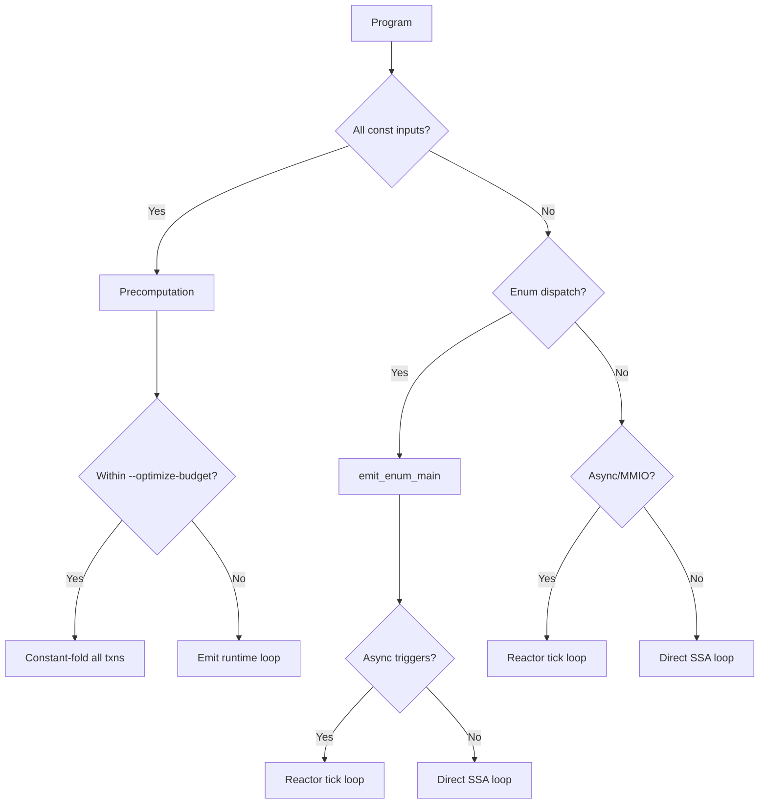

# Optimization Pipeline

**Date:** 2026-06-11
**Status:** Current

## Decision Tree

After parsing, typechecking, and proof engine, the compiler enters a
decision tree that selects the codegen strategy per program:

## Codegen Strategies

### Precomputation (--optimize-budget)

When all inputs are compile-time constants (no `frgn __get_env_int` calls
in the hot path), the interpreter evaluates each reactive transaction up
to the `--optimize-budget` limit (default 256). If all transactions converge
within the budget, the final state is emitted as a single `store i64 N,
%state.field` — the entire loop is folded away.

Detection: `analysis/region_analyzer.rs` — `is_fully_precomputable(budget)`.
If the program has runtime-determined inputs (`__get_env_int`, `frgn` calls
in the loop body), precomputation is disabled.

--dev vs --prod:
- --dev (default, budget=256): fast compilation, precomputes small loops
- --prod (budget=u64::MAX): fully precomputes every bounded loop
- --optimize-budget <N>: overrides both

### Direct SSA Loop (A006 — 2026-06-10)

For programs with NO async triggers and NO MMIO mappings, the reactor tick
dispatch function (`@reactor_tick`) is eliminated. Instead, a tight `while`
loop is emitted directly in `main()`, using phi nodes for field state.

File: `src/backend/llvm/loop_engine.rs` — `emit_direct_ssa_main()`

Key features:
- Per-field GEP codegen: `getelementptr %State, %State* %state, i32 0, i32 N`
  instead of `load %State; extractvalue; insertvalue; store %State`
- SROA promotion: LLVM promotes `%State` alloca fields to phi nodes
- Self-loop on precondition failure replaced with direct branch to `done`
  label (2026-06-11), enabling LLVM loop unrolling
- `loop_exit_label` for `term!` inside reactive loops emits `br %done`
  instead of `ret`, also enabling unrolling

### Reactor Tick Loop

For programs with async triggers or MMIO, the reactor tick function is
emitted as a separate `@reactor_tick` function that the runtime calls.
This is the legacy codegen path (emit_declare_loop).

File: `src/backend/llvm/emit_toplevel.rs`

## SLP Hazard Analysis

File: `src/backend/llvm/hazard.rs`

The compiler estimates register pressure from SLP vectorization candidates.
If the estimated peak live floats exceeds hardware register count, SLP is
disabled to avoid spilling.

### compute_peak_live_floats (2026-06-11)

Replaces `max_float_temps` (which counted ALL float temporaries as
simultaneously live). The new liveness-interval analysis:

1. For each float temp: find its def point (Let binding) and last use
   (last statement referencing it)
2. For field reads: def point is the first reference
3. Sweep program points counting active intervals → true peak register demand

Impact: nbody_sqrt went from 1.17x slower to 1.22x faster than C.

## Equality Saturation

File: `src/analysis/saturate.rs` — `saturate_program()`

A 5-pass fixpoint engine with 9 rewrite rules that runs over the expression
AST before codegen:

| Rule | Pattern | Result |
|------|---------|--------|
| Add zero | `x + 0` | `x` |
| Mul one | `x * 1` | `x` |
| Sub self | `x - x` | `0` |
| And true | `x && true` | `x` |
| Double neg | `!!x` | `x` |
| Ternary | `x ? true : false` | `x` |
| Const fold | literal arithmetic | result |
| Or true | `x || true` | `true` |
| And false | `x && false` | `false` |

Each pass walks the expression tree bottom-up. Repeats until no rule fires
or 5 iterations are exhausted.

## Dispatch Collapse

File: `src/analysis/transition_graph.rs`

Preconditions evaluate against pre-tick state. Guards referencing unchanged
fields are skipped. The dispatch analysis builds a dependency graph between
state fields and transaction guards. When a tick updates field X, the
compiler walks the graph to find only the transactions whose guards
reference X.

## Copy Elimination

File: `src/backend/llvm/mod.rs` — `emit_expr` for `Expr::FieldAccess`

When loading a field value that was just stored (same field, same tick),
the load is replaced with `add i64 0, <stored_value>` — a register copy
instead of a memory load.

## Benchmark-Specific Optimizations

### nbody_sqrt (SLP fix)

The nbody benchmark has ~30 float fields with ~90 ALU operations per tick.
SLP vectorization was falsely disabled because `max_float_temps` counted
~113 simultaneously-live float temps when the true peak was ~6. The
liveness-interval fix corrected this.

### fannkuch_redux (self-loop + loop_exit_label)

The fannkuch benchmark's hot loop had two structural issues preventing
LLVM optimization:
1. Precondition failure created a live self-loop (`br i1 %ok, %body, %tick`)
   that LLVM could not eliminate. Fixed by branching to `done_{txn}`.
2. `term!` inside the loop body emitted `ret`, making the loop appear
   non-countable to LLVM's unroller. Fixed by emitting `br %done` via
   `loop_exit_label`.

Combined impact: 3.85x → 0.98x (brief ties C).

## Related Files

| File | Role |
|------|------|
| `src/backend/llvm/loop_engine.rs` | Direct SSA loop emission, self-loop fix, loop_exit_label |
| `src/backend/llvm/hazard.rs` | SLP hazard analysis, compute_peak_live_floats |
| `src/backend/llvm/emit_expr.rs` | Expr codegen (per-field GEP, copy elimination) |
| `src/backend/llvm/mod.rs` | Field index map, exit condition, codegen dispatch |
| `src/analysis/saturate.rs` | Equality saturation pass |
| `src/analysis/region_analyzer.rs` | Precomputation budget analysis |
| `src/analysis/transition_graph.rs` | Dispatch collapse |
