<!-- 2026-06-09 -->

# Brief Compiler Architecture Overview

## System Architecture

The Brief compiler transforms Brief source code into executable output
across multiple backends (LLVM IR, VHDL, Webstack, C, etc.). The pipeline
follows a layered pass architecture:

```mermaid
flowchart LR
    Source --> Lexer
    Lexer --> Parser
    Parser --> TypeUniverse
    TypeUniverse --> ImportResolver
    ImportResolver --> Desugarer
    Desugarer --> Typechecker
    Typechecker --> ProofEngine
    ProofEngine --> Annotator
    Annotator --> Analysis
    Analysis --> Codegen
    Codegen --> Output
```



## Module Responsibilities

| Module | File | Responsibility |
|--------|------|----------------|
| Lexer | `lexer.rs` | Tokenizes source text into `Token` stream using `logos` |
| Parser | `parser.rs` | Pratt-style precedence climbing, produces `Program` AST. Tracks `sed_item_names` for file-private items. Parses `<:` struct derivation syntax. |
| Type-Universe | `type_universe.rs` | Pass 1: collect/resolve/freeze `Type Name <: Base` declarations |
| Import Resolver | `import_resolver.rs` | Resolves `import` paths, builds module graph. Filters `sed` items from exported symbols. Cache stores `(Program, Vec<String>)` pairs. |
| Desugarer | `desugarer.rs` | Lowers sugar syntax to core AST. Flattens struct derivation chains (parent fields → child), detects field collisions. |
| Typechecker | `typechecker.rs` | Infers and checks types, validates contracts. Enforces field visibility (`Sedentary` cross-file check). Validates struct derivation upcast (`B <: A → B compatible with A`). |
| Proof Engine | `proof_engine.rs` | Symbolic verification of contracts, convergence analysis |
| Annotator | `annotator.rs` | File-level attribute processing |
| Analysis | `analysis/` | Call graph, dependency graph (trg dirty-flag), dataflow, transition graph, PGO, region, SLP hazard |
| Backend | `backend/` | Code generation for target (LLVM, CIRCT, Webstack, etc.) |
| Interpreter | `interpreter.rs` | Reference implementation — evaluates Brief directly |

## Feature File Architecture (Pattern B)

The compiler uses **Pattern B**: each language construct has its own file
in `src/features/` with co-located struct definition, parse helper,
typechecking, evaluation, and per-backend codegen. The pass files become
thin routers that delegate to feature modules.

```
src/features/
  traits.rs           — Expr traits (ExprTypecheck, ExprEval, ExprCodegen*)
                        + Statement traits (StmtTypecheck, StmtEval, StmtCodegen*)
  literal.rs          — Expr::Literal(LiteralExpr) — Phase 1.1
  binary_op.rs        — Expr::BinaryOp(BinaryOpExpr) — Phase 1.2
  unary_op.rs         — Expr::UnaryOp(UnaryOpExpr) — Phase 1.2
  call.rs             — Expr::CallExpr(CallExpr) — Phase 1.3
  projection.rs       — Expr::ProjectionExpr(ProjectionExpr) — Phase 1.3
  collection.rs       — List/Map/Set literal exprs — Phase 1.3
  tuple.rs            — Tuple, TupleDestructure exprs — Phase 1.3
  field.rs            — FieldAccess, StructInstance, ObjectLiteral — Phase 1.3
  pattern.rs          — PatternMatch, Match exprs — Phase 1.4
  block.rs            — BlockExpr — Phase 1.4
  arrow.rs            — ArrowMut, ArrowDiscard, ArrowTransfer — Phase 1.4
  subtype.rs          — SubtypeProjectionExpr — Phase 1.4
  sigcall.rs          — SigCallExpr — Phase 1.4
  dbvl.rs             — DbvlTableExpr — Phase 1.4
  ellipsis.rs         — EllipsisExpr — Phase 1.4
  stmt/
    mod.rs            — Module declarations
    assignment.rs     — AssignmentStmt — Phase 2
    let_binding.rs    — LetBindingStmt
    guarded.rs        — GuardedStmt
    term.rs           — TermStmt, TermBangStmt
    escape.rs         — EscapeStmt
    expression.rs     — ExpressionStmt
    unification.rs    — UnificationStmt
    inline_asm.rs     — InlineAsmStmt
    local_trigger.rs  — LocalTriggerStmt
    alka.rs           — AlkaStmt
    on_exit.rs        — OnExitStmt
    sync_block.rs     — SyncBlockStmt
  toplevel/
    mod.rs            — Module declarations
    typedef.rs        — TopLevel::TypeDef — Phase 1.5
    signature.rs      — TopLevel::Signature — Phase 3
    definition.rs     — TopLevel::Definition
    transaction.rs    — TopLevel::Transaction
    state_decl.rs     — TopLevel::StateDecl
    trigger.rs        — TopLevel::Trigger
    constant.rs       — TopLevel::Constant
    import_lnk.rs     — TopLevel::Import
    foreign.rs        — TopLevel::ForeignBinding
    resource.rs       — TopLevel::ResourceDecl
    struct_def.rs     — TopLevel::Struct
    rstruct.rs        — TopLevel::RStruct
    enum_def.rs       — TopLevel::Enum
    render.rs         — TopLevel::RenderBlock
    svg.rs            — TopLevel::SvgComponent
    sync_group.rs     — TopLevel::SyncGroup
    test.rs           — TestItem (pragmas)
    assertion.rs      — AssertionItem (pragmas)
```

## Pass Data Flow

See `channel-map.md` for detailed per-pass data contracts.
