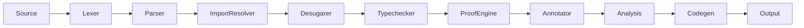

<!-- 2026-06-09 -->

# Brief Compiler Architecture Overview

## System Architecture

The Brief compiler transforms Brief source code into executable output
across multiple backends (LLVM IR, VHDL, Webstack, C, etc.). The pipeline
follows a layered pass architecture:

## Module Responsibilities

| Module | File | Responsibility |
|--------|------|----------------|
| Lexer | `lexer.rs` | Tokenizes source text into `Token` stream using `logos` |
| Parser | `parser.rs` | Pratt-style precedence climbing, produces `Program` AST |
| Import Resolver | `import_resolver.rs` | Resolves `import` paths, builds module graph |
| Desugarer | `desugarer.rs` | Lowers sugar syntax to core AST |
| Typechecker | `typechecker.rs` | Infers and checks types, validates contracts |
| Proof Engine | `proof_engine.rs` | Symbolic verification of contracts and assertions |
| Annotator | `annotator.rs` | File-level attribute processing |
| Analysis | `analysis/` | Call graph, dataflow, transition graph, PGO, region, SLP hazard |
| Backend | `backend/` | Code generation for target (LLVM, VHDL, Webstack, etc.) |
| Interpreter | `interpreter.rs` | Reference implementation — evaluates Brief directly |

## Pass Data Flow

See `channel-map.md` for detailed per-pass data contracts.
