<!-- 2026-06-09 -->

# Brief Compiler Architecture Overview

## System Architecture

The Brief compiler transforms Brief source code into executable output
across multiple backends (LLVM IR, VHDL, Webstack, C, etc.). The pipeline
follows a layered pass architecture:

```mermaid
flowchart LR
    Source --> Lexer
    Lexer --> Parser
    Parser --> TypeUniverse
    TypeUniverse --> ImportResolver
    ImportResolver --> Desugarer
    Desugarer --> Typechecker
    Typechecker --> ProofEngine
    ProofEngine --> Annotator
    Annotator --> Analysis
    Analysis --> Codegen
    Codegen --> Output
```

**Phases 1-6 (2026-07-03):** The pointer system was extended with
layout-constrained pointers (`Type::LayoutPtr`), layout-compatible casts,
spatial intrinsics (`__memcpy#`/`__memcmp#`/`__memset#`/`__hash#`),
function pointers via `:> Ptr`, opaque handles, and EOR optimization.
The architecture was renamed per this feature set. All code follows the
max-2-levels flat control flow rule.



## Module Responsibilities

| Module | File | Responsibility |
|--------|------|----------------|
| Lexer | `lexer.rs` | Tokenizes source text into `Token` stream using `logos` |
| Parser | `parser.rs` | Pratt-style precedence climbing, produces `Program` AST. Tracks `sed_item_names` for file-private items. Parses `<:` struct derivation syntax. |
| Type-Universe | `type_universe.rs` | Pass 1: collect/resolve/freeze `Type Name <: Base` declarations |
| Import Resolver | `import_resolver.rs` | Resolves `import` paths, builds module graph. Filters `sed` items from exported symbols. Cache stores `(Program, Vec<String>)` pairs. |
| Desugarer | `desugarer.rs` | Lowers sugar syntax to core AST. Flattens struct derivation chains (parent fields → child), detects field collisions. |
| Typechecker | `typechecker.rs` | Infers and checks types, validates contracts. Enforces field visibility (`Sedentary` cross-file check). Validates struct derivation upcast (`B <: A → B compatible with A`). |
| Proof Engine | `proof_engine.rs` | Symbolic verification of contracts, convergence analysis |
| Annotator | `annotator.rs` | File-level attribute processing |
| Analysis | `analysis/` | Call graph, dependency graph (trg dirty-flag), dataflow, transition graph, PGO, region, SLP hazard |
| Backend | `backend/` | Code generation for target (LLVM, CIRCT, Webstack, etc.) |
| Interpreter | `interpreter.rs` | Reference implementation — evaluates Brief directly |

## Announcement Arrow (`<~`) — Compile-Time Metadata

**Added 2026-06-30 (Phase C/D).** The `<~` token (TildeArrow) provides a
uniform mechanism for compile-time annotations on declarations:

- **Type body bindings**: `bytes <~ 8;` replaces `Bytes = 8;`
- **Definition annotations**: `defn compute <~ priority: 2 (x: Int) -> Int`
- **Transaction annotations**: `txn process <~ retry: 3, #atomic [pre][post]`
- **Trigger annotations**: `trigger tick: Int <~ period: 100 @timer#(1000)`
- **Hashtag shorthand**: `#volatile` inside a type body desugars to `volatile <~ true`

Annotation values are arbitrary expressions (integers, strings, bools,
identifiers). Unknown annotation names are preserved as user-defined
projections on the `ResolvedType` in the TypeUniverse.

## Bootstrap Type Universe

**Added 2026-06-30 (Phase C).** The 14 built-in primitive types (`Int`,
`Float`, `Bool`, etc.) are defined in `lib/std/types/bootstrap.bv` using the
`<~` annotation syntax. Every `.bv` file auto-imports this file via the
ImportResolver. Previously these were hardcoded Rust struct literals in
`type_universe.rs`.

The compiler uses **Pattern B**: each language construct has its own file
in `src/features/` with co-located struct definition, parse helper,
typechecking, evaluation, and per-backend codegen. The pass files become
thin routers that delegate to feature modules.

```
src/features/
  traits.rs           — Expr traits (ExprTypecheck, ExprEval, ExprCodegen*)
                        + Statement traits (StmtTypecheck, StmtEval, StmtCodegen*)
  literal.rs          — Expr::Literal(LiteralExpr) — Phase 1.1
  binary_op.rs        — Expr::BinaryOp(BinaryOpExpr) — Phase 1.2
  unary_op.rs         — Expr::UnaryOp(UnaryOpExpr) — Phase 1.2
  call.rs             — Expr::CallExpr(CallExpr) — Phase 1.3
  projection.rs       — Expr::ProjectionExpr(ProjectionExpr) — Phase 1.3
  collection.rs       — List/Map/Set literal exprs — Phase 1.3
  tuple.rs            — Tuple, TupleDestructure exprs — Phase 1.3
  field.rs            — FieldAccess, StructInstance, ObjectLiteral — Phase 1.3
  pattern.rs          — PatternMatch, Match exprs — Phase 1.4
  block.rs            — BlockExpr — Phase 1.4
  arrow.rs            — ArrowMut, ArrowDiscard, ArrowTransfer — Phase 1.4
  subtype.rs          — SubtypeProjectionExpr — Phase 1.4
  sigcall.rs          — SigCallExpr — Phase 1.4
  dbvl.rs             — DbvlTableExpr — Phase 1.4
  ellipsis.rs         — EllipsisExpr — Phase 1.4
  stmt/
    mod.rs            — Module declarations
    assignment.rs     — AssignmentStmt — Phase 2
    let_binding.rs    — LetBindingStmt
    guarded.rs        — GuardedStmt
    term.rs           — TermStmt, TermBangStmt
    escape.rs         — EscapeStmt
    expression.rs     — ExpressionStmt
    unification.rs    — UnificationStmt
    inline_asm.rs     — InlineAsmStmt
    local_trigger.rs  — LocalTriggerStmt
    alka.rs           — AlkaStmt
    on_exit.rs        — OnExitStmt
    sync_block.rs     — SyncBlockStmt
    foreach.rs        — ForeachStmt (NEW 2026-06-15)
  toplevel/
    mod.rs            — Module declarations
    typedef.rs        — TopLevel::TypeDef — Phase 1.5
    signature.rs      — TopLevel::Signature — Phase 3
    definition.rs     — TopLevel::Definition
    transaction.rs    — TopLevel::Transaction
    state_decl.rs     — TopLevel::StateDecl
    trigger.rs        — TopLevel::Trigger
    constant.rs       — TopLevel::Constant
    import_lnk.rs     — TopLevel::Import
    foreign.rs        — TopLevel::ForeignBinding
    resource.rs       — TopLevel::ResourceDecl
    struct_def.rs     — TopLevel::Struct
    rstruct.rs        — TopLevel::RStruct
    enum_def.rs       — TopLevel::Enum
    render.rs         — TopLevel::RenderBlock
    svg.rs            — TopLevel::SvgComponent
    sync_group.rs     — TopLevel::SyncGroup
    test.rs           — TestItem (pragmas)
    assertion.rs      — AssertionItem (pragmas)
```

## Pass Data Flow

See `channel-map.md` for detailed per-pass data contracts.

## Backend Architecture (LLVM)

The LLVM backend (`src/backend/llvm/`) uses a three-tier context architecture
to prevent state leakage between compiled functions:

| Context | Scope | Mutability | Contents |
|---------|-------|------------|----------|
| `CompilerContext` | Global (entire compilation) | Immutable during codegen | AST definitions, FFI signatures, target spec, type info |
| `FunctionContext` | Per-function/transaction | Mutable (scoped) | SSA counter, local bindings, phi state, arena |
| `BlockContext` | Per-basic-block | Mutable (transient) | Current label |

## LLVM Loop Dispatch Architecture

The compiler has three dispatch paths for countable loops, chosen
adaptively based on transaction characteristics:

### A005a — Inline SSA (insertvalue chain)
- Single `%State` phi + `extractvalue`/`insertvalue` for field access
- Selected when `write_density >= 0.5 && field_count < 8 && !has_body_ffi`
- Best for dense-write, small-state loops (e.g., knucleotide: 4 fields)
- Added `a849b2d` (2026-07-05)

### A005c — Per-Field Phi (default for most loops)
- Each state field gets its own SSA phi node at loop header
- Selected for sparse writes, large states, or FFI-containing bodies
- Supports: Path A (zero stores in hot loop), phi commit block,
  parallel-safe mode (ssa_old cache keeps old phi values),
  dead-field liveness analysis, !invariant.load for read-only fields
- Reverted from A005e hybrid memory mode in `4ff9bde` (2026-07-05)

### A000c — Pure Counter Fold
- For pure bodies with compile-time constant bounds — O(1) single store

### Optimization Results (2026-07-06)

All measurements at BOUND=50000000, 5 iterations, CLOCK_MONOTONIC.
Run-to-run variation is ~5-10%. Ranges show min/max across 3+ runs.

| Benchmark | Best | Current | MISMATCH | Key change |
|-----------|------|---------|----------|------------|
| nbody_newton | **0.63x** | **0.68–0.74x** | Fixed | Phase C+E + vector phi |
| nbody_sqrt | **0.79x** | **0.82–0.86x** | Fixed | Correct vector phi backedge |
| nbody_sqrt_idio | **0.67x** | **0.70–0.81x** | Fixed | Correct vector phi backedge |
| fannkuch_redux | **1.37x** | **1.14–1.31x** | MATCH | Rotation decomposition |
| knucleotide | **0.99x** | **0.98–1.00x** | MATCH | Precomputation fix |
| mandelbrot | **1.10x** | **0.99–1.00x** | MATCH | IR bug fix |
| queue_drain | **1.02x** | **0.97–0.99x** | MATCH | IR bug fix |
| float_math | **0.83x** | **0.81–0.84x** | MATCH | Liveness fix |
| fasta | MISMATCH | **0.96–1.01x** | Fixed | PutChar FFI detection |
| bit_clear | MISMATCH | **1.00–1.12x** | Fixed | Local variable fix |
| sparse_dispatch | 0x (broken) | **1.33–1.37x** | Fixed | Copy loop + threshold |

Note: ~10% regression on nbody_sqrt_idio from a849b2d (0.64x) to ae5b016 (0.70x)
is the inherent cost of correct backedge values. The old code had poison/UB
(elements 1-3 of vector phis were undefined). See
`docs/plans/2026-07-06-isolate-extractelement-regression.md` for full analysis.

Key architectural decisions:
- **A005c over A005e** (`4ff9bde`): Per-field phis eliminate memory traffic
  vs hybrid counter-phi+memory. interval_step: 0.01x vs 1.00x (100× faster).
- **FFI guard in dispatch** (`981819c`): A005a blocked for FFI-containing
  bodies to prevent LLVM from eliminating fprintf through @stdout analysis.
- **Vector phi emission** (`a849b2d`): Groups of 4 related fields (vx0..vx3)
  promoted to `<4 x float>` phis, eliminating register spills from 32 scalar
  float phis. Reduced phi count from 32 to ~14 (fits in 16 XMM regs).
- **Rotation decomposition** (`ca9f483`): GEP-reload latch breaks 12-element
  circular phi chain for fannkuch_redux. Failed step-k approach documented
  in `docs/plans/2026-07-05-fannkuch-rotation-decomposition.md`.

See `docs/architecture/backend-refactor.md` for the full architecture guide.
